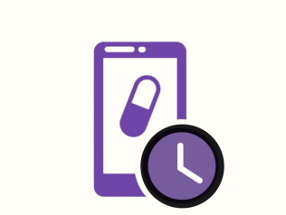
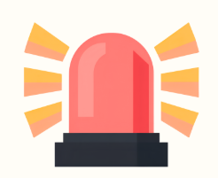
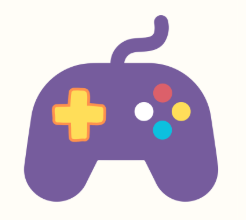
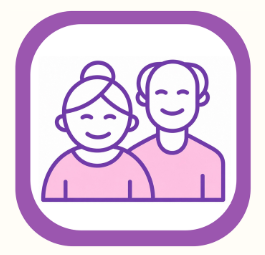
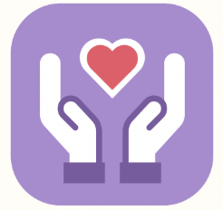

auth-script.js
// ========== LOGIN PAGE ==========

function getRoleFromQuery() {
    const params = new URLSearchParams(window.location.search);
    return params.get('role'); // 'family' | 'caregiver' | null
}

function switchAuthTab(tab) {
    const signinTab = document.getElementById('tab-signin');
    const signupTab = document.getElementById('tab-signup');
    const signinForm = document.getElementById('login-form');
    const signupForm = document.getElementById('signup-form');
    if (!signinTab || !signupTab) return;

    const isSignin = tab === 'signin';
    signinTab.classList.toggle('active', isSignin);
    signupTab.classList.toggle('active', !isSignin);
    signinForm.style.display = isSignin ? 'block' : 'none';
    signupForm.style.display = isSignin ? 'none' : 'block';
    document.getElementById('login-error').style.display = 'none';
}

document.addEventListener('DOMContentLoaded', function () {
    const subtitle = document.getElementById('role-subtitle');
    const role = getRoleFromQuery();
    if (subtitle && role) {
        const labels = { family: 'Family sign in', caregiver: 'Caregiver sign in' };
        subtitle.textContent = labels[role] || 'Welcome to MORY!';
    }

    const signinForm = document.getElementById('login-form');
    if (!signinForm) return; // this script also loads on the welcome/dashboard pages — nothing else to do there

    signinForm.addEventListener('submit', async function (e) {
        e.preventDefault();
        const username = document.getElementById('login-username').value.trim();
        const password = document.getElementById('login-password').value;
        const errorBox = document.getElementById('login-error');
        errorBox.style.display = 'none';

        try {
            const res = await fetch('/api/auth/login', {
                method: 'POST',
                headers: { 'Content-Type': 'application/json' },
                credentials: 'include',
                body: JSON.stringify({ username, password })
            });
            const data = await res.json();

            if (!res.ok) {
                errorBox.textContent = data.error || 'Could not sign in.';
                errorBox.style.display = 'block';
                return;
            }

            // Always trust the server's role, not whatever ?role= was in the URL
            window.location.href = data.user.role === 'caregiver' ? '/caregiver' : '/family';

        } catch (err) {
            errorBox.textContent = 'Connection error: ' + err.message;
            errorBox.style.display = 'block';
        }
    });

    const signupForm = document.getElementById('signup-form');
    if (signupForm) {
        signupForm.addEventListener('submit', async function (e) {
            e.preventDefault();
            const name = document.getElementById('signup-name').value.trim();
            const email = document.getElementById('signup-email').value.trim();
            const password = document.getElementById('signup-password').value;
            const errorBox = document.getElementById('login-error');
            errorBox.style.display = 'none';

            const signupRole = role || 'family'; // fall back sensibly if opened without ?role=

            try {
                const res = await fetch('/api/auth/register', {
                    method: 'POST',
                    headers: { 'Content-Type': 'application/json' },
                    credentials: 'include',
                    body: JSON.stringify({ name, email, password, role: signupRole })
                });
                const data = await res.json();

                if (!res.ok) {
                    errorBox.textContent = data.error || 'Could not create account.';
                    errorBox.style.display = 'block';
                    return;
                }

                window.location.href = data.user.role === 'caregiver' ? '/caregiver' : '/family';

            } catch (err) {
                errorBox.textContent = 'Connection error: ' + err.message;
                errorBox.style.display = 'block';
            }
        });
    }
});

// ========== SHARED DASHBOARD AUTH GUARD ==========
// Call this at the top of both family-dashboard.html and caregiver-dashboard.html.
// Redirects to login if not authenticated or wrong role; otherwise resolves
// with the logged-in user.
async function requireAuth(expectedRole) {
    try {
        const res = await fetch('/api/auth/me', { credentials: 'include' });
        if (!res.ok) {
            window.location.href = '/login?role=' + expectedRole;
            return null;
        }
        const data = await res.json();
        if (data.user.role !== expectedRole) {
            window.location.href = '/login?role=' + expectedRole;
            return null;
        }
        return data.user;
    } catch (err) {
        window.location.href = '/login?role=' + expectedRole;
        return null;
    }
}

async function logoutAndRedirect() {
    try {
        await fetch('/api/auth/logout', { method: 'POST', credentials: 'include' });
    } catch (err) {
        // ignore — redirecting anyway
    }
    window.location.href = '/';
}

// ========== SOS / EMERGENCY ALERT (welcome screen) ==========

function bindHoldToAlert(buttonEl, overlayEl) {
    if (!buttonEl) return;
    let holdTimer = null;
    let holding = false;

    const start = () => {
        if (holding) return;
        holding = true;
        buttonEl.classList.add('holding');
        holdTimer = setTimeout(() => {
            triggerSosAlert(overlayEl);
        }, 3000);
    };
    const cancelHold = () => {
        holding = false;
        buttonEl.classList.remove('holding');
        clearTimeout(holdTimer);
    };

    buttonEl.addEventListener('mousedown', start);
    buttonEl.addEventListener('touchstart', start, { passive: true });
    buttonEl.addEventListener('mouseup', cancelHold);
    buttonEl.addEventListener('mouseleave', cancelHold);
    buttonEl.addEventListener('touchend', cancelHold);
}

async function triggerSosAlert(overlayEl) {
    let latitude = null, longitude = null;

    // Best-effort location — alert still fires even if geolocation is denied/unavailable
    try {
        const position = await new Promise((resolve, reject) => {
            if (!navigator.geolocation) return reject('no geolocation');
            navigator.geolocation.getCurrentPosition(resolve, reject, { timeout: 4000 });
        });
        latitude = position.coords.latitude;
        longitude = position.coords.longitude;
    } catch (err) {
        console.log('Location unavailable for SOS alert:', err);
    }

    try {
        await fetch('/api/emergency/alert', {
            method: 'POST',
            headers: { 'Content-Type': 'application/json' },
            body: JSON.stringify({ latitude, longitude, seniorName: 'Ah Ma' })
        });
    } catch (err) {
        console.error('Failed to send SOS alert:', err);
    }

    if (overlayEl) overlayEl.style.display = 'block';
}

async function cancelSosAlert() {
    try {
        await fetch('/api/emergency/cancel', { method: 'POST' });
    } catch (err) {
        // ignore — hiding the overlay either way
    }
    const overlay = document.getElementById('sos-overlay');
    if (overlay) overlay.style.display = 'none';
}

document.addEventListener('DOMContentLoaded', function () {
    const sosBtn = document.getElementById('welcome-sos-btn');
    const sosOverlay = document.getElementById('sos-overlay');
    if (sosBtn) bindHoldToAlert(sosBtn, sosOverlay);
});


caregiver-dashboard.html
<!DOCTYPE html>
<html lang="en">
<head>
    <meta charset="UTF-8">
    <meta name="viewport" content="width=device-width, initial-scale=1.0">
    <title>MORY - Caregiver Dashboard</title>
    <link href="https://fonts.googleapis.com/css2?family=Lexend:wght@400;500;600;700;800&display=swap" rel="stylesheet">
    <link rel="stylesheet" href="dashboard-style.css">
</head>
<body>
    <nav class="dash-topbar">
        <span class="dash-brand"> MORY — Caregiver</span>
        <button class="dash-logout-btn" onclick="logoutAndRedirect()">Log Out</button>
    </nav>

    <main class="dash-container" id="dash-main">
        <div style="text-align:center;padding:40px 0;opacity:0.6;">Loading...</div>
    </main>

    <!-- Emergency Alert takeover -->
    <div id="emergency-overlay" class="emergency-overlay">
        <h1>🚨 Emergency Alert</h1>
        <div class="emergency-banner" id="emergency-banner-text">EMERGENCY ALERT</div>
        <p class="emergency-detail" id="emergency-detail-text"></p>
        <button class="dash-action-btn gold" id="emergency-location-btn" style="display:none;margin-bottom:16px;" onclick="openEmergencyLocation()">📍 Current Location</button>
        <p style="font-weight:700;color:var(--purple-main);margin-bottom:30px;">Please reach out or check on them immediately.</p>
        <button class="dash-action-btn secondary" onclick="resolveEmergencyAlert()">I've responded — Dismiss</button>
    </div>

    <script src="auth-script.js"></script>
    <script src="caregiver-script.js"></script>
</body>
</html>

caregiver-script.js
function formatTime12hCg(timeStr) {
    const [h, m] = (timeStr || '00:00').split(':').map(Number);
    const period = h >= 12 ? 'PM' : 'AM';
    const h12 = h % 12 === 0 ? 12 : h % 12;
    return `${h12}:${String(m).padStart(2, '0')} ${period}`;
}

const CG_STATUS_CLASS = { taken: 'pill-taken', due: 'pill-due', overdue: 'pill-overdue', upcoming: 'pill-upcoming' };
const CG_STATUS_LABEL = { taken: '✅ Taken', due: '⏰ Due Now', overdue: '🔴 Overdue', upcoming: '🕒 Upcoming' };

let cgUser = null;

async function loadCaregiverDashboard() {
    cgUser = await requireAuth('caregiver');
    if (!cgUser) return;

    document.getElementById('dash-main').innerHTML = ''; // clear "Loading..." placeholder
    await Promise.all([renderCaregiverSummary(), renderCaregiverMedTracker(), renderCareJournalInput()]);
}

async function renderCaregiverSummary() {
    let summary;
    try {
        const res = await fetch('/api/dashboard/summary', { credentials: 'include' });
        summary = await res.json();
    } catch (err) {
        return; // med tracker section will still show its own error if this fails
    }

    const existing = document.getElementById('cg-summary-card');
    const html = `
        <h2>👋 Hi ${escapeHtmlCg(cgUser.name)} — Today's Snapshot</h2>
        <div class="dash-row">
            <span>💊 Medication</span>
            <strong>${summary.medication.completed}/${summary.medication.total} completed</strong>
        </div>
        <div class="dash-row">
            <span>🧠 Brain Game</span>
            <strong>${summary.brainGame.completedToday ? '✅ Completed' : '— Not yet today'}</strong>
        </div>
    `;
    if (existing) {
        existing.innerHTML = html;
    } else {
        const card = document.createElement('div');
        card.className = 'dash-card';
        card.id = 'cg-summary-card';
        card.innerHTML = html;
        document.getElementById('dash-main').prepend(card);
    }
}

async function renderCaregiverMedTracker() {
    const main = document.getElementById('dash-main');
    let existingTracker = document.getElementById('cg-med-card');

    let meds;
    try {
        const res = await fetch('/api/pills', { credentials: 'include' });
        const data = await res.json();
        meds = data.medications || [];
    } catch (err) {
        const card = existingTracker || document.createElement('div');
        card.className = 'dash-card';
        card.id = 'cg-med-card';
        card.innerHTML = `<h2>💊 Medication Tracker</h2>Couldn't load medications.<br><small>${err.message}</small>`;
        if (!existingTracker) main.appendChild(card);
        return;
    }

    const rows = meds.map(m => `
        <div class="dash-row">
            <div>
                <strong>${escapeHtmlCg(m.name)}</strong> — ${escapeHtmlCg(m.dosage)}<br>
                <span class="dash-muted">${escapeHtmlCg(m.purpose)} · ${formatTime12hCg(m.time)}</span>
            </div>
            <div style="text-align:right;">
                <span class="dash-status-pill ${CG_STATUS_CLASS[m.status]}">${CG_STATUS_LABEL[m.status]}</span><br>
                ${m.status !== 'taken' ? `<button class="dash-action-btn" style="margin-top:6px;" onclick="cgMarkTaken('${m.id}')">Mark Taken</button>` : ''}
            </div>
        </div>
    `).join('');

    const card = existingTracker || document.createElement('div');
    card.className = 'dash-card';
    card.id = 'cg-med-card';
    card.innerHTML = `<h2>💊 Medication Tracker</h2>${rows || '<div class="dash-muted">No medications on file.</div>'}`;
    if (!existingTracker) main.appendChild(card);
}

async function cgMarkTaken(id) {
    try {
        await fetch(`/api/pills/${id}/take`, { method: 'POST', credentials: 'include' });
        renderCaregiverMedTracker();
        renderCaregiverSummary();
    } catch (err) {
        alert('Could not mark as taken: ' + err.message);
    }
}

// ========== DAILY CARE JOURNAL (caregiver writes/speaks, Gonka structures it) ==========

const JOURNAL_LANG_MAP = {
    en: 'en-US',
    ms: 'ms-MY',
    tl: 'fil-PH', // Tagalog
    my: 'my-MM'   // Burmese
};

let journalRecognition = null;
let journalListening = false;

function initJournalRecognition() {
    const SpeechRecognition = window.SpeechRecognition || window.webkitSpeechRecognition;
    if (!SpeechRecognition) return null;
    const recognition = new SpeechRecognition();
    recognition.continuous = false;
    recognition.interimResults = false;
    return recognition;
}

function toggleJournalMic() {
    const langSelect = document.getElementById('journal-lang');
    const textarea = document.getElementById('journal-textarea');
    const micBtn = document.getElementById('journal-mic-btn');

    if (journalListening && journalRecognition) {
        journalRecognition.stop();
        return;
    }

    journalRecognition = initJournalRecognition();
    if (!journalRecognition) {
        alert('Voice input isn\'t supported in this browser. Please type the observation instead.');
        return;
    }

    journalRecognition.lang = JOURNAL_LANG_MAP[langSelect.value] || 'en-US';
    journalListening = true;
    micBtn.textContent = '🔴 Listening... (tap to stop)';

    journalRecognition.onresult = (event) => {
        const transcript = event.results[0][0].transcript;
        textarea.value = textarea.value ? textarea.value + ' ' + transcript : transcript;
    };
    journalRecognition.onerror = () => {
        journalListening = false;
        micBtn.textContent = '🎙️ Speak Observation';
    };
    journalRecognition.onend = () => {
        journalListening = false;
        micBtn.textContent = '🎙️ Speak Observation';
    };

    journalRecognition.start();
}

async function renderCareJournalInput() {
    const main = document.getElementById('dash-main');
    const card = document.createElement('div');
    card.className = 'dash-card';
    card.id = 'cg-journal-card';
    card.innerHTML = `
        <h2>📝 Daily Care Journal</h2>
        <div class="dash-muted" style="margin-bottom:10px;">
            Write or speak a short note about today — appetite, sleep, mood, anything worth mentioning.
            MORY will turn it into a clean summary for the family.
        </div>
        <div style="display:flex;gap:8px;margin-bottom:8px;align-items:center;flex-wrap:wrap;">
            <label class="dash-muted" style="font-weight:700;">Speak in:</label>
            <select id="journal-lang" style="padding:6px 10px;border-radius:8px;border:2px solid var(--purple-main);">
                <option value="en">English</option>
                <option value="ms">Bahasa Melayu</option>
                <option value="tl">Tagalog</option>
                <option value="my">Burmese</option>
            </select>
        </div>
        <textarea id="journal-textarea" rows="4" placeholder="e.g. Today Ah Ma didn't eat much lunch, but she slept quite well."
            style="width:100%;padding:12px;border-radius:12px;border:2px solid var(--purple-main);font-size:0.95em;font-family:inherit;"></textarea>
        <div style="display:flex;gap:8px;margin-top:10px;flex-wrap:wrap;">
            <button id="journal-mic-btn" class="dash-action-btn secondary" onclick="toggleJournalMic()">🎙️ Speak Observation</button>
            <button class="dash-action-btn" onclick="submitCareJournal()">💾 Save Entry</button>
        </div>
        <div id="journal-result" style="margin-top:12px;"></div>
        <div id="journal-history" style="margin-top:14px;"></div>
    `;
    main.appendChild(card);

    loadJournalHistory();
}

async function submitCareJournal() {
    const textarea = document.getElementById('journal-textarea');
    const resultBox = document.getElementById('journal-result');
    const rawInput = textarea.value.trim();

    if (!rawInput) {
        alert('Please write or speak something first.');
        return;
    }

    resultBox.innerHTML = '<div class="dash-muted">Structuring your note...</div>';

    try {
        const res = await fetch('/api/care-journal', {
            method: 'POST',
            headers: { 'Content-Type': 'application/json' },
            credentials: 'include',
            body: JSON.stringify({ rawInput })
        });
        const data = await res.json();

        if (!res.ok) {
            resultBox.innerHTML = `<div style="color:#B23A48;">${escapeHtmlCg(data.error || 'Something went wrong.')}</div>`;
            return;
        }

        resultBox.innerHTML = `
            <div class="dash-empty-note" style="background:var(--sage-bg);">
                <strong>Saved ✅</strong><br>
                "${escapeHtmlCg(data.entry.summarySentence)}"<br><br>
                🍚 ${escapeHtmlCg(data.entry.appetite)} · 😴 ${escapeHtmlCg(data.entry.sleepQuality)} · 😊 ${escapeHtmlCg(data.entry.mood)} · 🚶 ${escapeHtmlCg(data.entry.activityLevel)} · 💧 ${escapeHtmlCg(data.entry.hydration)}
                ${data.entry.observationNote ? `<br><br>⚠️ ${escapeHtmlCg(data.entry.observationNote)}` : ''}
            </div>
        `;
        textarea.value = '';
        loadJournalHistory();
    } catch (err) {
        resultBox.innerHTML = `<div style="color:#B23A48;">Connection error: ${escapeHtmlCg(err.message)}</div>`;
    }
}

async function loadJournalHistory() {
    const historyBox = document.getElementById('journal-history');
    try {
        const res = await fetch('/api/care-journal', { credentials: 'include' });
        const data = await res.json();
        const rows = (data.entries || []).slice(0, 5).map(e => `
            <div style="font-size:0.85em;padding:6px 0;border-bottom:1px solid rgba(0,0,0,0.06);">
                <strong>${e.date}</strong> — ${escapeHtmlCg(e.summarySentence)}
            </div>
        `).join('');
        historyBox.innerHTML = rows
            ? `<div class="dash-muted" style="font-weight:700;margin-bottom:4px;">Recent Entries</div>${rows}`
            : '';
    } catch (err) {
        // silent — history is a nice-to-have, not critical
    }
}

function escapeHtmlCg(str) {
    if (!str) return '';
    return String(str).replace(/&/g, '&amp;').replace(/</g, '&lt;').replace(/>/g, '&gt;').replace(/"/g, '&quot;');
}

document.addEventListener('DOMContentLoaded', function () {
    loadCaregiverDashboard();
    pollEmergencyStatus();
    setInterval(pollEmergencyStatus, 5000);
});

// ========== EMERGENCY ALERT (takeover screen) ==========
// Poll-based, not push — only surfaces while this dashboard is open. See
// server-side note in server.js for why there's no instant notification here.

let currentEmergencyLocation = null;

async function pollEmergencyStatus() {
    try {
        const res = await fetch('/api/emergency/status', { credentials: 'include' });
        if (!res.ok) return; // not logged in, or session expired — ignore quietly
        const data = await res.json();
        const overlay = document.getElementById('emergency-overlay');

        if (data.active) {
            currentEmergencyLocation = data.active.location;
            const time = new Date(data.active.triggeredAt).toLocaleTimeString([], { hour: '2-digit', minute: '2-digit' });
            document.getElementById('emergency-detail-text').textContent =
                `${data.active.seniorName} has pressed their emergency button at ${time}.`;
            document.getElementById('emergency-location-btn').style.display = data.active.location ? 'inline-block' : 'none';
            overlay.classList.add('active');
        } else {
            overlay.classList.remove('active');
        }
    } catch (err) {
        // silent — this is a background poll, not a user-triggered action
    }
}

function openEmergencyLocation() {
    if (!currentEmergencyLocation) return;
    const { latitude, longitude } = currentEmergencyLocation;
    window.open(`https://www.google.com/maps?q=${latitude},${longitude}`, '_blank');
}

async function resolveEmergencyAlert() {
    try {
        await fetch('/api/emergency/resolve', { method: 'POST', credentials: 'include' });
    } catch (err) {
        // ignore
    }
    document.getElementById('emergency-overlay').classList.remove('active');
}

elder-script.js
let baseFontSize = 22;
let conversationHistory = [];
let isProcessing = false;

// ========== UI TRANSLATION ==========
// Covers the app's persistent "chrome" — home screen, settings panel, and
// screen titles — the text seen on nearly every screen. Deeper modal content
// (pill forms, game screens, call list) isn't translated yet; those remain
// English regardless of dialect for now. Hokkien/Hakka written forms below
// are a best-effort approximation — written conventions for these are less
// standardized than Mandarin/Cantonese/BM, so a native speaker review is
// worth doing before relying on these for a real launch.
const UI_TEXT = {
    english: {
        goodDay: 'Good Day!', back: 'BACK ◄',
        cardScan: 'Scan Medication', cardPills: 'My Pills', cardCall: 'Call',
        cardTalk: 'Talk to MORY', cardAlert: 'Alert', cardGames: 'Games',
        settingsTitle: 'Settings', textSize: 'Text Size',
        dialectLabel: '🗣️ Speaking Language / Dialect', gonkaLabel: 'Gonka:',
        testConnection: '🔌 Test Connection', quickTest: '💬 Quick Test', close: 'Close',
        pressToTalk: 'Press here to talk', talkToMoryTitle: 'Talk to MORY'
    },
    mandarin: {
        goodDay: '你好！', back: '返回 ◄',
        cardScan: '扫描药物', cardPills: '我的药物', cardCall: '通话',
        cardTalk: '和MORY说话', cardAlert: '紧急求助', cardGames: '游戏',
        settingsTitle: '设置', textSize: '文字大小',
        dialectLabel: '🗣️ 语言/方言', gonkaLabel: 'Gonka：',
        testConnection: '🔌 测试连接', quickTest: '💬 快速测试', close: '关闭',
        pressToTalk: '按这里说话', talkToMoryTitle: '和MORY说话'
    },
    cantonese: {
        goodDay: '你好！', back: '返回 ◄',
        cardScan: '掃描藥物', cardPills: '我嘅藥物', cardCall: '打電話',
        cardTalk: '同MORY傾偈', cardAlert: '緊急求助', cardGames: '遊戲',
        settingsTitle: '設定', textSize: '文字大細',
        dialectLabel: '🗣️ 語言/方言', gonkaLabel: 'Gonka：',
        testConnection: '🔌 測試連接', quickTest: '💬 快速測試', close: '關閉',
        pressToTalk: '撳呢度講嘢', talkToMoryTitle: '同MORY傾偈'
    },
    hokkien: {
        goodDay: '你好！', back: '返回 ◄',
        cardScan: '掃描藥仔', cardPills: '我的藥仔', cardCall: '拍電話',
        cardTalk: '佮MORY講話', cardAlert: '緊急求救', cardGames: '遊戲',
        settingsTitle: '設定', textSize: '字體大細',
        dialectLabel: '🗣️ 語言/腔口', gonkaLabel: 'Gonka：',
        testConnection: '🔌 測試連線', quickTest: '💬 緊來試', close: '關閉',
        pressToTalk: '揤遮講話', talkToMoryTitle: '佮MORY講話'
    },
    hakka: {
        goodDay: '你好！', back: '轉來 ◄',
        cardScan: '掃描藥仔', cardPills: '𠊎个藥仔', cardCall: '打電話',
        cardTalk: '同MORY講話', cardAlert: '緊急求救', cardGames: '遊戲',
        settingsTitle: '設定', textSize: '字體大細',
        dialectLabel: '🗣️ 語言/話', gonkaLabel: 'Gonka：',
        testConnection: '🔌 測試連線', quickTest: '💬 隨時試', close: '關咧',
        pressToTalk: '接𠊎講話', talkToMoryTitle: '同MORY講話'
    },
    bm: {
        goodDay: 'Selamat Sejahtera!', back: 'KEMBALI ◄',
        cardScan: 'Imbas Ubat', cardPills: 'Ubat Saya', cardCall: 'Panggil',
        cardTalk: 'Bercakap dengan MORY', cardAlert: 'Kecemasan', cardGames: 'Permainan',
        settingsTitle: 'Tetapan', textSize: 'Saiz Teks',
        dialectLabel: '🗣️ Bahasa / Dialek', gonkaLabel: 'Gonka:',
        testConnection: '🔌 Uji Sambungan', quickTest: '💬 Uji Pantas', close: 'Tutup',
        pressToTalk: 'Tekan sini untuk bercakap', talkToMoryTitle: 'Bercakap dengan MORY'
    }
};

function applyUiTranslations() {
    const dialect = document.getElementById('dialect-picker')?.value || 'english';
    const dict = UI_TEXT[dialect] || UI_TEXT.english;
    document.querySelectorAll('[data-i18n]').forEach(el => {
        const key = el.getAttribute('data-i18n');
        if (dict[key]) el.textContent = dict[key];
    });
}

// ========== CONTINUOUS CONVERSATION STATE ==========
let conversationActive = false;   // true while MORY is in an open back-and-forth
let silenceStrikes = 0;           // consecutive "heard nothing" retries this session
const MAX_SILENCE_STRIKES = 2;    // after this many silent turns, stop auto-listening

// Phrases (per dialect) that mean "I'm done talking, MORY" — checked against
// what the elderly person actually said, before we bother calling the AI.
const STOP_PHRASES = {
    cantonese: ['拜拜', '唔使喇', '夠喇', '收line'],
    hokkien: ['拜拜', '好啊', '免啊', '夠啊'],
    hakka: ['拜拜', '毋使', '夠了'],
    mandarin: ['拜拜', '再见', '不用了', '够了', '没事了'],
    english: ['bye', 'goodbye', 'stop', 'that\'s all', 'that is all', 'no more', 'enough', 'i\'m done', 'im done', 'thank you that\'s all', 'nothing else'],
    bm: ['bye', 'selamat tinggal', 'sudah cukup', 'tak payah', 'sudah']
};

// Speech-synthesis language codes, matching the recognition language map below
const TTS_LANG_MAP = {
    cantonese: 'zh-HK',
    hokkien: 'zh-TW',
    hakka: 'zh-CN',
    mandarin: 'zh-CN',
    english: 'en-US',
    bm: 'ms-MY'
};

function saidGoodbye(transcript, dialect) {
    const text = (transcript || '').toLowerCase().trim();
    const phrases = STOP_PHRASES[dialect] || STOP_PHRASES.english;
    return phrases.some(p => text.includes(p.toLowerCase()));
}

// Speak MORY's reply aloud, then (if the conversation is still active)
// automatically start listening for the elderly person's next turn.
function speakReply(text, dialect) {
    if (!('speechSynthesis' in window) || !text) {
        // No TTS available in this browser — just keep the loop going
        // after a short pause so it still feels conversational.
        if (conversationActive) {
            setTimeout(() => startSpeechRecognition(), 800);
        }
        return;
    }

    window.speechSynthesis.cancel(); // stop anything currently speaking

    const utterance = new SpeechSynthesisUtterance(text);
    utterance.lang = TTS_LANG_MAP[dialect] || 'en-US';
    utterance.rate = 0.95; // slightly slower — easier for elderly listeners to follow

    utterance.onend = () => {
        if (conversationActive) {
            startSpeechRecognition();
        }
    };
    utterance.onerror = () => {
        if (conversationActive) {
            startSpeechRecognition();
        }
    };

    window.speechSynthesis.speak(utterance);
}

// Elderly person taps "Stop Talking", or a goodbye phrase was detected.
function endConversation(dialect) {
    conversationActive = false;
    silenceStrikes = 0;
    if ('speechSynthesis' in window) {
        window.speechSynthesis.cancel();
    }

    const goodbyes = {
        cantonese: '好呀，拜拜！有需要隨時嗌我。',
        hokkien: '好啊，拜拜！有需要隨時叫我。',
        hakka: '好，拜拜！有需要隨時喊𠊎。',
        mandarin: '好的，再见！有需要随时叫我。',
        english: "Okay, bye for now! Just tap the heart anytime you want to talk again.",
        bm: 'Baiklah, jumpa lagi! Tekan hati bila-bila masa nak berbual lagi.'
    };
    const msg = goodbyes[dialect] || goodbyes.english;

    openElderlyModal(
        '💜 See You Soon',
        `<div style="text-align:center;padding:10px 0;">${msg}</div>
         <button class="action-btn" onclick="closeElderlyModal()">✅ Done</button>`
    );
    // conversationActive is already false above, so speakReply's onend
    // handler won't re-trigger listening — this just speaks the goodbye once.
    speakReply(msg, dialect);
}

// ========== FONT CONTROLS ==========
function adjustFont(delta) {
    baseFontSize += delta;
    if (baseFontSize < 16) baseFontSize = 16;
    if (baseFontSize > 34) baseFontSize = 34;
    document.documentElement.style.setProperty('--base-font-size', baseFontSize + 'px');
}

function resetFont() {
    baseFontSize = 22;
    document.documentElement.style.setProperty('--base-font-size', '22px');
}

// ========== MODAL CONTROLS ==========
function openElderlyModal(title, contentHtml) {
    document.getElementById('modal-title').innerHTML = title;
    document.getElementById('modal-body').innerHTML = contentHtml;
    document.getElementById('elderly-modal').style.display = 'block';
}

function closeElderlyModal() {
    document.getElementById('elderly-modal').style.display = 'none';
}

function toggleSettingsPanel() {
    document.getElementById('settings-panel').classList.toggle('open');
}

// ========== GONKA STATUS ==========
function updateGonkaStatus(dialect) {
    const statusDot = document.querySelector('.status-dot') || document.getElementById('status-dot');
    const nodeSpan = document.getElementById('gonka-node');
    
    const latencies = {
        'cantonese': '18ms',
        'hokkien': '22ms',
        'hakka': '25ms',
        'mandarin': '15ms',
        'english': '12ms',
        'bm': '30ms'
    };
    
    const nodes = {
        'cantonese': 'Node #482 (Cantonese-Whisper-v2)',
        'hokkien': 'Node #204 (Hokkien-Speech-Local)',
        'hakka': 'Node #308 (Hakka-Dialect-Engine)',
        'mandarin': 'Node #012 (Mandarin-FastLLM)',
        'english': 'Node #001 (English-Llama3)',
        'bm': 'Node #109 (Malay-Local-Node)'
    };
    
    const nodeMap = {
        'cantonese': 'Gonka Node #102 (Cantonese-Whisper-v2)',
        'hokkien': 'Gonka Node #204 (Hokkien-Speech-Local)',
        'hakka': 'Gonka Node #308 (Hakka-Dialect-Engine)',
        'mandarin': 'Gonka Node #012 (Mandarin-FastLLM)',
        'english': 'Gonka Node #001 (English-Llama3)',
        'bm': 'Gonka Node #109 (Malay-Local-Node)'
    };
    
    // Update status dot
    if (statusDot) {
        statusDot.style.backgroundColor = '#2ECC71';
        statusDot.style.boxShadow = '0 0 8px #2ECC71';
    }
    
    // Update node display
    if (nodeSpan) {
        nodeSpan.innerHTML = nodes[dialect] || 'Node #001 (English-Llama3)';
    }
    
    // Update dialect node
    const nodeDisplay = document.getElementById('current-dialect-node');
    if (nodeDisplay) {
        nodeDisplay.innerHTML = nodeMap[dialect] || 'Gonka Edge Mesh';
    }
}

// ========== DIALECT PICKER ==========
document.addEventListener('DOMContentLoaded', function() {
    applyUiTranslations();

    const picker = document.getElementById('dialect-picker');
    if (picker) {
        const defaultDialect = picker.value;
        updateGonkaStatus(defaultDialect);
    }

    // Pills: check status right away, then every 30s while the page is open
    refreshPillsBadge();
    setInterval(refreshPillsBadge, 30000);
});

document.getElementById('dialect-picker')?.addEventListener('change', function(e) {
    const selected = e.target.value;
    updateGonkaStatus(selected);
});

// ========== TEST CONNECTION ==========
async function testServerConnection() {
    openElderlyModal(
        '🔌 Testing Connection', 
        'Checking if MORY server is running...<br><br>' +
        '<div style="font-size:1.2em;">⏳ Testing...</div>'
    );
    
    try {
        const response = await fetch('/api/health');
        if (!response.ok) {
            throw new Error(`HTTP ${response.status}`);
        }
        const data = await response.json();
        
        openElderlyModal(
            '✅ Server Connected!', 
            'MORY server is running properly!<br><br>' +
            '📡 Gonka Router: ' + data.gonkaRouter + '<br>' +
            '📦 Version: ' + data.version + '<br>' +
            '🕐 Time: ' + new Date(data.timestamp).toLocaleString() + '<br><br>' +
            '✅ You can now use voice input!'
        );
    } catch (error) {
        openElderlyModal(
            '❌ Server Not Found', 
            'MORY server is not running!<br><br>' +
            'Please open a terminal and run:<br>' +
            '<code style="background:#f0f0f0;padding:8px;display:block;border-radius:8px;margin:10px 0;font-size:0.8em;">node server.js</code>' +
            'Then refresh this page and try again.<br><br>' +
            '<small style="color:#666;">Error: ' + error.message + '</small>'
        );
    }
}

// ========== SEND TO GONKA ==========
async function sendToGonkaCompanion(userVoiceText) {
    if (isProcessing) {
        openElderlyModal('⏳ Please Wait', 'MORY is still thinking... Please wait a moment.');
        return;
    }
    
    const selectedDialect = document.getElementById('dialect-picker').value;

    // If the elderly person said a goodbye phrase, end the loop right here —
    // no need to spend a Gonka call on it.
    if (saidGoodbye(userVoiceText, selectedDialect)) {
        endConversation(selectedDialect);
        return;
    }

    isProcessing = true;
    
    // Show loading state with improved UI
    openElderlyModal(
        '💜 Talking to MORY', 
        '<div style="text-align:center;">' +
        '<div style="font-size:3em;margin-bottom:10px;">💜</div>' +
        '⏳ Connecting to Gonka Network...<br><br>' +
        '<span style="font-size:0.8em;opacity:0.7;">Routing via ' + 
        (selectedDialect === 'cantonese' ? 'Cantonese' : 
         selectedDialect === 'hokkien' ? 'Hokkien' : 
         selectedDialect === 'hakka' ? 'Hakka' : 
         selectedDialect === 'mandarin' ? 'Mandarin' : 
         selectedDialect === 'bm' ? 'Bahasa Melayu' : 'English') + 
        ' node</span><br>' +
        '<span style="font-size:0.7em;opacity:0.5;">' + userVoiceText + '</span>' +
        '</div>'
    );

    try {
        const response = await fetch('/api/companion/chat', {
            method: 'POST',
            headers: { 
                'Content-Type': 'application/json',
                'Accept': 'application/json'
            },
            body: JSON.stringify({
                userMessage: userVoiceText,
                dialect: selectedDialect,
                conversationHistory: conversationHistory.slice(-12), // real multi-turn context
                memoryContext: { 
                    favoriteMusic: "Teresa Teng", 
                    homeTown: "Ipoh"
                }
            })
        });

        if (!response.ok) {
            // Try to get error message from response
            const errorData = await response.json().catch(() => ({}));
            throw new Error(errorData.error || `HTTP error! status: ${response.status}`);
        }

        const data = await response.json();
        
        // Add to conversation history
        conversationHistory.push({ role: 'user', content: userVoiceText });
        conversationHistory.push({ role: 'assistant', content: data.reply });
        
        // Keep history manageable
        if (conversationHistory.length > 20) {
            conversationHistory = conversationHistory.slice(-20);
        }

        // Update UI with real AI reply
        const nodeDisplay = data.routedNode || 'Gonka Network';
        const latencyDisplay = data.latency || '18ms';
        const isFallback = data.fallback ? '📡 Offline Mode' : '🌐 Online';
        const fallbackNote = data.fallback ? '<br><span style="font-size:0.7em;opacity:0.6;color:#FF6B6B;">⚠️ Using offline fallback responses</span>' : '';

        openElderlyModal(
            `💜 MORY (${nodeDisplay})`, 
            `<div style="text-align:left;padding:10px 0;">
                <strong>MORY:</strong> "${data.reply}"<br><br>
                <span style="font-size:0.7em;opacity:0.6;">
                    🗣️ ${selectedDialect} · ⚡ ${latencyDisplay} · ${isFallback}
                </span>
                ${fallbackNote}
                ${conversationActive ? '<br><br><span style="font-size:0.7em;opacity:0.7;">🎙️ Listening again after MORY finishes speaking...</span>' : ''}
             </div>
             <div style="display:flex;gap:8px;margin-top:12px;flex-wrap:wrap;">
                <button class="action-btn" onclick="sendQuickReply()" style="flex:1;min-width:100px;">💬 Quick Reply</button>
                <button class="action-btn" onclick="endConversation('${selectedDialect}')" style="flex:1;min-width:100px;background-color:#B23A48;">🛑 Stop Talking</button>
             </div>`
        );

        // Reset silence counter — we just had a real exchange
        silenceStrikes = 0;
        // Speak MORY's reply; when it finishes, speakReply() auto-starts
        // listening again as long as conversationActive is still true.
        speakReply(data.reply, selectedDialect);

    } catch (err) {
        console.error('Gonka API Error:', err);
        
        // Get fallback response
        const fallbackReplies = {
            'cantonese': '阿嫲，MORY 聽到你講嘢！你想我幫你做啲咩？',
            'hokkien': '阿嫲，MORY 聽到你講話！你愛我幫你做啥？',
            'hakka': '阿嬤，MORY 聽到你講話！你想 𠊎 幫你做麼個？',
            'mandarin': '奶奶，MORY听到您说话了！您想让我帮您做什么？',
            'english': 'Ah Ma, MORY is listening! How can I help you today?',
            'bm': 'Nenek, MORY sedang mendengar! Apa yang boleh saya bantu?'
        };
        
        const offlineReply = fallbackReplies[selectedDialect] || fallbackReplies.english;

        openElderlyModal(
            '💜 MORY (Offline Mode)', 
            `<div style="text-align:left;padding:10px 0;">
                <strong>MORY:</strong> "${offlineReply}"<br><br>
                <span style="font-size:0.7em;opacity:0.6;">📡 Offline Mode (Gonka reconnecting...)</span>
                <br><br>
                <small style="color:#666;">${err.message || 'Connection issue'}</small>
             </div>
             <div style="display:flex;gap:8px;margin-top:12px;flex-wrap:wrap;">
                <button class="action-btn" onclick="sendQuickReply()" style="flex:1;min-width:100px;">💬 Try Again</button>
                <button class="action-btn" onclick="endConversation('${selectedDialect}')" style="flex:1;min-width:100px;background-color:#B23A48;">🛑 Stop Talking</button>
             </div>`
        );

        speakReply(offlineReply, selectedDialect);
    } finally {
        isProcessing = false;
    }
}

// ========== QUICK REPLY ==========
function sendQuickReply() {
    const quickMessages = [
        "What medicine do I take next?",
        "Tell me a story",
        "Play some music",
        "What's the weather today?",
        "How are you today?",
        "I'm feeling a bit tired"
    ];
    const randomMessage = quickMessages[Math.floor(Math.random() * quickMessages.length)];
    sendToGonkaCompanion(randomMessage);
}

// ========== VOICE INPUT ==========
function startVoiceInput() {
    // Tapping the heart (re)starts an active conversation session —
    // MORY will keep listening/replying on its own until the elderly
    // person says a goodbye phrase or taps "Stop Talking".
    conversationActive = true;
    silenceStrikes = 0;

    // Check if server is accessible first
    fetch('/api/health')
        .then(response => {
            if (!response.ok) {
                throw new Error('Server not reachable');
            }
            return response.json();
        })
        .then(() => {
            // Server is running, proceed with voice
            startSpeechRecognition();
        })
        .catch((error) => {
            console.warn('Server check failed, trying voice anyway:', error);
            // Still try voice recognition, might work offline
            startSpeechRecognition();
        });
}

function startSpeechRecognition() {
    // Check if browser supports speech recognition
    const SpeechRecognition = window.SpeechRecognition || window.webkitSpeechRecognition;
    
    if (!SpeechRecognition) {
        openElderlyModal(
            '📱 Not Supported', 
            'Voice input is not supported in your browser.<br><br>' +
            'Please use Chrome, Edge, or Safari for voice features.<br><br>' +
            '<button class="action-btn" onclick="sendQuickReply()">💬 Use Quick Reply Instead</button>'
        );
        return;
    }

    const recognition = new SpeechRecognition();
    const selectedDialect = document.getElementById('dialect-picker').value;
    
    // Map dialect to speech recognition language codes
    const languageMap = {
        'cantonese': 'zh-HK',
        'hokkien': 'zh-TW',
        'hakka': 'zh-CN',
        'mandarin': 'zh-CN',
        'english': 'en-US',
        'bm': 'ms-MY'
    };
    
    recognition.lang = languageMap[selectedDialect] || 'en-US';
    recognition.continuous = false;
    recognition.interimResults = false;
    recognition.maxAlternatives = 1;
    
    // Show listening status with animation
    openElderlyModal(
        '🎤 Listening...', 
        '<div style="text-align:center;padding:20px 0;">' +
        '<div style="font-size:4em;animation:pulse 1s infinite;">🎙️</div>' +
        '<p style="margin-top:10px;">Please speak clearly into the microphone.</p>' +
        '<p style="font-size:0.8em;opacity:0.6;">Speaking: ' + selectedDialect + '</p>' +
        '<style>' +
        '@keyframes pulse {' +
        '  0% { transform: scale(1); }' +
        '  50% { transform: scale(1.1); }' +
        '  100% { transform: scale(1); }' +
        '}' +
        '</style>' +
        '</div>'
    );
    
    // Update voice hint
    const hint = document.getElementById('voiceHint');
    if (hint) {
        hint.textContent = '🎤 Listening... Speak now!';
        hint.style.background = 'rgba(255,255,255,0.3)';
    }
    
    recognition.onstart = function() {
        console.log('🎤 Speech recognition started');
    };
    
    recognition.onresult = function(event) {
        const transcript = event.results[0][0].transcript;
        console.log('✅ Speech recognized:', transcript);
        
        // Update hint
        const hint = document.getElementById('voiceHint');
        if (hint) {
            hint.textContent = '"' + transcript + '"';
            hint.style.background = 'rgba(255,255,255,0.2)';
        }
        
        // Send to MORY
        sendToGonkaCompanion(transcript);
    };
    
    recognition.onerror = function(event) {
        console.error('❌ Speech recognition error:', event.error);
        
        // Reset hint
        const hint = document.getElementById('voiceHint');
        if (hint) {
            hint.textContent = 'Tap the heart to speak';
            hint.style.background = 'rgba(255,255,255,0.2)';
        }
        
        const selectedDialect = document.getElementById('dialect-picker')?.value || 'english';

        // Handle specific errors
        if (event.error === 'not-allowed') {
            conversationActive = false; // can't auto-recover from a permission denial
            openElderlyModal(
                '🔇 Microphone Access Denied', 
                'Please allow microphone access in your browser settings, then try again.<br><br>' +
                '<button class="action-btn" onclick="startVoiceInput()">🔄 Try Again</button>'
            );
        } else if (event.error === 'no-speech') {
            if (conversationActive) {
                // Mid-conversation: don't interrupt with an error popup every
                // time — just quietly try listening again, up to a limit.
                silenceStrikes++;
                if (silenceStrikes <= MAX_SILENCE_STRIKES) {
                    setTimeout(() => startSpeechRecognition(), 600);
                    return;
                }
                // Gave the elderly person a couple of quiet chances — stop
                // listening on our own so the mic doesn't run forever.
                endConversation(selectedDialect);
                return;
            }
            openElderlyModal(
                '🎤 No Speech Detected', 
                'No speech was detected. Please try again and speak clearly.<br><br>' +
                '<button class="action-btn" onclick="startVoiceInput()">🔄 Try Again</button><br>' +
                '<button class="action-btn" onclick="sendQuickReply()" style="background-color:#3B5E43;">💬 Use Quick Reply</button>'
            );
        } else if (event.error === 'audio-capture') {
            conversationActive = false;
            openElderlyModal(
                '🎤 Microphone Error', 
                'Could not access microphone. Please check:<br><br>' +
                '• Microphone is plugged in<br>' +
                '• Browser has permission<br>' +
                '• No other app is using it<br><br>' +
                '<button class="action-btn" onclick="startVoiceInput()">🔄 Try Again</button>'
            );
        } else {
            conversationActive = false;
            openElderlyModal(
                '🎤 Microphone Error', 
                'Error: ' + event.error + '<br><br>Please try again or use quick reply.<br><br>' +
                '<button class="action-btn" onclick="startVoiceInput()">🔄 Try Again</button><br>' +
                '<button class="action-btn" onclick="sendQuickReply()" style="background-color:#3B5E43;">💬 Quick Reply</button>'
            );
        }
    };
    
    recognition.onend = function() {
        console.log('🎤 Speech recognition ended');
        // Reset hint if no result was received
        const hint = document.getElementById('voiceHint');
        if (hint && !hint.textContent.includes('"')) {
            hint.textContent = 'Tap the heart to speak';
            hint.style.background = 'rgba(255,255,255,0.2)';
        }
    };
    
    // Start recognition with a timeout
    try {
        recognition.start();
        
        // Auto-stop after 10 seconds if no speech
        setTimeout(() => {
            try {
                recognition.stop();
            } catch (e) {
                // Already stopped
            }
        }, 10000);
        
    } catch (error) {
        console.error('Error starting speech recognition:', error);
        openElderlyModal(
            '⚠️ Error', 
            'Could not start voice input. Please try again.<br><br>' +
            '<button class="action-btn" onclick="startVoiceInput()">🔄 Try Again</button>'
        );
    }
}

// ========== MAKE FUNCTIONS GLOBAL ==========
// ========== MEDICINE SCANNER ==========
// This feature is a READING AID ONLY — every result carries a visible
// disclaimer, and we never show fabricated fields when the photo is unclear.

const MEDICINE_DISCLAIMER_TEXT = "⚠️ This is a reading guide only, based on your photo. It is not medical advice — please always confirm with your pharmacist or doctor before taking any medication.";

function triggerMedicineScan() {
    document.getElementById('medicine-photo-input').click();
}

function fileToBase64(file) {
    return new Promise((resolve, reject) => {
        const reader = new FileReader();
        reader.onload = () => resolve(reader.result); // data: URL — server accepts this directly
        reader.onerror = reject;
        reader.readAsDataURL(file);
    });
}

async function handleMedicinePhotoSelected(event) {
    const file = event.target.files && event.target.files[0];
    // Reset the input so selecting the *same* file again (e.g. after a retake) still fires onchange
    event.target.value = '';
    if (!file) return;

    const selectedDialect = document.getElementById('dialect-picker').value;

    openElderlyModal(
        '📷 Reading Label...',
        `<div class="scanner-box">
            📷 <strong>Reading your photo...</strong><br><br>
            This can take a few seconds.
         </div>
         <div style="font-size:0.75em;opacity:0.7;margin-top:8px;">${MEDICINE_DISCLAIMER_TEXT}</div>`
    );

    try {
        const imageBase64 = await fileToBase64(file);

        const response = await fetch('/api/scan-medicine', {
            method: 'POST',
            headers: { 'Content-Type': 'application/json' },
            body: JSON.stringify({ imageBase64, dialect: selectedDialect })
        });

        const data = await response.json();
        renderMedicineResult(data, selectedDialect);

    } catch (err) {
        console.error('Medicine scan failed:', err);
        openElderlyModal(
            '📷 Couldn\'t Read That',
            `<div style="text-align:left;">
                Something went wrong reading the photo. Please check your connection and try again.<br><br>
                <small style="color:#666;">${err.message || ''}</small><br><br>
                <div style="font-size:0.75em;opacity:0.7;">${MEDICINE_DISCLAIMER_TEXT}</div>
             </div>
             <button class="action-btn" onclick="triggerMedicineScan()">🔁 Try Again</button>`
        );
    }
}

function renderMedicineResult(data, dialect) {
    const disclaimer = data.disclaimer || MEDICINE_DISCLAIMER_TEXT.replace('⚠️ ', '');

    if (!data.legible) {
        // Never show fabricated fields — only the "please retake" message.
        openElderlyModal(
            '📷 Photo Not Clear',
            `<div style="text-align:left;padding:6px 0;">
                <strong>MORY:</strong> "${data.elderlySummary || "I couldn't read this clearly. Could you try again?"}"
                <div style="font-size:0.75em;opacity:0.7;margin-top:10px;">⚠️ ${disclaimer}</div>
             </div>
             <div style="display:flex;gap:8px;margin-top:12px;flex-wrap:wrap;">
                <button class="action-btn" onclick="triggerMedicineScan()" style="flex:1;min-width:100px;">🔁 Retake Photo</button>
                <button class="action-btn" onclick="closeElderlyModal()" style="flex:1;min-width:100px;background-color:#3B5E43;">✅ Done</button>
             </div>`
        );
        speakReply(data.elderlySummary, dialect);
        return;
    }

    // Ah Ma's view: big, warm, plain-language, spoken aloud.
    // Caregiver's view: collapsible, shows the exact printed fields + raw OCR
    // text so a family member can double-check nothing was misread.
    const caregiverDetailsId = 'caregiver-details-' + Date.now();

    openElderlyModal(
        `💊 ${data.medicineName || 'Medicine Info'}`,
        `<div style="text-align:left;padding:6px 0;">
            <strong>MORY:</strong> "${data.elderlySummary || ''}"
         </div>
         <div style="font-size:0.75em;opacity:0.7;margin-top:10px;text-align:left;">⚠️ ${disclaimer}</div>

         <button class="action-btn" style="background-color:#3B5E43;margin-top:14px;"
                 onclick="const el=document.getElementById('${caregiverDetailsId}'); el.style.display = el.style.display==='none' ? 'block' : 'none';">
            👨‍👩‍👧 Show Details for Caregiver
         </button>

         <div id="${caregiverDetailsId}" style="display:none;text-align:left;margin-top:12px;background:var(--sage-bg);border-radius:14px;padding:14px;font-size:0.85em;">
            <strong>Medicine:</strong> ${escapeHtml(data.medicineName) || '—'}<br>
            <strong>Purpose:</strong> ${escapeHtml(data.purposePlain) || '—'}<br>
            <strong>Dosage (as printed):</strong> ${escapeHtml(data.dosage) || '—'}<br>
            <strong>Timing (as printed):</strong> ${escapeHtml(data.timing) || '—'}<br>
            <strong>Warnings (as printed):</strong> ${escapeHtml(data.warnings) || 'None printed'}<br><br>
            <strong>Note:</strong> ${escapeHtml(data.caregiverNote) || ''}<br><br>
            <details>
                <summary style="cursor:pointer;">Raw scanned text (to verify against the label)</summary>
                <div style="white-space:pre-wrap;font-size:0.9em;opacity:0.8;margin-top:6px;">${escapeHtml(data.ocrText) || '(none)'}</div>
            </details>
         </div>

         <div style="display:flex;gap:8px;margin-top:14px;flex-wrap:wrap;">
            <button class="action-btn" onclick="triggerMedicineScan()" style="flex:1;min-width:100px;">🔁 Scan Another</button>
            <button class="action-btn" onclick="closeElderlyModal()" style="flex:1;min-width:100px;background-color:#3B5E43;">✅ Done</button>
         </div>`
    );

    speakReply(data.elderlySummary, dialect);
}

function escapeHtml(str) {
    if (!str) return '';
    return String(str)
        .replace(/&/g, '&amp;')
        .replace(/</g, '&lt;')
        .replace(/>/g, '&gt;')
        .replace(/"/g, '&quot;');
}


// ========== PILLS REMINDER ==========

let currentPillsData = [];      // last fetched medications list, cached for edit/delete forms
let remindedKeys = new Set();   // `${id}:${date}:${status}` already alerted this session — avoids alert spam
let editingMedId = null;        // set while the add/edit form is in "editing" mode

const STATUS_LABELS = {
    taken: { emoji: '✅', text: 'Taken', color: '#3B5E43' },
    due: { emoji: '⏰', text: 'Due Now', color: '#C97A1E' },
    overdue: { emoji: '🔴', text: 'Overdue', color: '#B23A48' },
    upcoming: { emoji: '🕒', text: 'Upcoming', color: '#6D3B97' }
};

function formatTime12h(timeStr) {
    const [h, m] = (timeStr || '00:00').split(':').map(Number);
    const period = h >= 12 ? 'PM' : 'AM';
    const h12 = h % 12 === 0 ? 12 : h % 12;
    return `${h12}:${String(m).padStart(2, '0')} ${period}`;
}

async function fetchPills() {
    const res = await fetch('/api/pills');
    const data = await res.json();
    currentPillsData = data.medications || [];
    return currentPillsData;
}

// ---- Due-count badge on the "My Pills" card ----
async function refreshPillsBadge() {
    try {
        const meds = await fetchPills();
        const urgentCount = meds.filter(m => m.status === 'due' || m.status === 'overdue').length;
        const badge = document.getElementById('pills-due-badge');
        if (badge) {
            if (urgentCount > 0) {
                badge.textContent = urgentCount;
                badge.style.display = 'flex';
            } else {
                badge.style.display = 'none';
            }
        }
        checkForReminders(meds);
    } catch (err) {
        console.log('Pills badge refresh failed (server may be offline):', err.message);
    }
}

// ---- Active reminders ----
function checkForReminders(meds) {
    const today = new Date().toISOString().slice(0, 10);
    meds.forEach(med => {
        if (med.status !== 'due' && med.status !== 'overdue') return;
        const key = `${med.id}:${today}:${med.status}`;
        if (remindedKeys.has(key)) return;
        remindedKeys.add(key);
        fireReminder(med);
    });
}

function fireReminder(med) {
    const dialect = document.getElementById('dialect-picker')?.value || 'english';
    const label = STATUS_LABELS[med.status];

    const reminderText = {
        cantonese: `阿嫲，係時候食藥喇：${med.name}，${med.dosage}，治療${med.purpose}。`,
        hokkien: `阿嫲，時間到愛食藥矣：${med.name}，${med.dosage}，治療${med.purpose}。`,
        hakka: `阿嬤，該食藥了：${med.name}，${med.dosage}，治療${med.purpose}。`,
        mandarin: `奶奶，该吃药了：${med.name}，${med.dosage}，治疗${med.purpose}。`,
        english: `Ah Ma, it's time for your ${med.name}, ${med.dosage}, for ${med.purpose}.`,
        bm: `Nenek, sudah masa untuk ubat ${med.name}, ${med.dosage}, untuk ${med.purpose}.`
    };
    const text = reminderText[dialect] || reminderText.english;

    openElderlyModal(
        `${label.emoji} Time for Your Medicine`,
        `<div style="text-align:left;padding:6px 0;">
            <strong>MORY:</strong> "${text}"<br><br>
            <strong>${escapeHtml(med.name)}</strong> — ${escapeHtml(med.dosage)}<br>
            <span style="opacity:0.7;">${escapeHtml(med.purpose)} · ${formatTime12h(med.time)}</span>
         </div>
         <div style="display:flex;gap:8px;margin-top:14px;flex-wrap:wrap;">
            <button class="action-btn" onclick="markPillTaken('${med.id}')" style="flex:1;min-width:100px;">✅ Mark as Taken</button>
            <button class="action-btn" onclick="snoozePill('${med.id}')" style="flex:1;min-width:100px;background-color:#8E4EC6;">⏰ Remind in 10 min</button>
         </div>`
    );
    speakReply(text, dialect);
}

function snoozePill(id) {
    closeElderlyModal();
    // Let this medication alert again after 10 minutes, even if it's still
    // technically the same status, by clearing today's recorded key for it.
    const today = new Date().toISOString().slice(0, 10);
    setTimeout(() => {
        ['due', 'overdue'].forEach(s => remindedKeys.delete(`${id}:${today}:${s}`));
    }, 10 * 60 * 1000);
}

async function markPillTaken(id) {
    try {
        const res = await fetch(`/api/pills/${id}/take`, { method: 'POST' });
        const data = await res.json();
        currentPillsData = data.medications || [];
        openPillsChecklist(); // refresh the visible list right away
        refreshPillsBadge();
    } catch (err) {
        console.error('Failed to mark pill taken:', err);
    }
}

// ---- Main checklist screen ----
async function openPillsChecklist() {
    openElderlyModal('💊 Daily Pill Checklist', '<div style="text-align:center;">Loading...</div>');

    let meds;
    try {
        meds = await fetchPills();
    } catch (err) {
        openElderlyModal('💊 My Pills', `Couldn't load your medicine list. Please check your connection.<br><br><small style="color:#666;">${err.message}</small>`);
        return;
    }

    const rows = meds.map(med => {
        const label = STATUS_LABELS[med.status];
        return `
        <div style="border:2px solid ${label.color}22;border-left:6px solid ${label.color};border-radius:14px;padding:12px 14px;margin-bottom:10px;text-align:left;">
            <div style="display:flex;justify-content:space-between;align-items:center;gap:8px;">
                <div>
                    <strong>${escapeHtml(med.name)}</strong> — ${escapeHtml(med.dosage)}<br>
                    <span style="opacity:0.7;font-size:0.85em;">${escapeHtml(med.purpose)} · ${formatTime12h(med.time)}</span>
                </div>
                <span style="color:${label.color};font-weight:800;white-space:nowrap;">${label.emoji} ${label.text}</span>
            </div>
            <div style="display:flex;gap:8px;margin-top:10px;">
                ${med.status !== 'taken'
                    ? `<button class="action-btn" style="flex:1;min-height:44px;padding:8px;" onclick="markPillTaken('${med.id}')">✅ Mark Taken</button>`
                    : `<span style="flex:1;font-size:0.8em;opacity:0.6;align-self:center;">Taken today</span>`}
                <button class="action-btn" style="flex:0 0 auto;min-height:44px;padding:8px 14px;background-color:#8E4EC6;" onclick="openMedicineForm('${med.id}')">✏️</button>
                <button class="action-btn" style="flex:0 0 auto;min-height:44px;padding:8px 14px;background-color:#B23A48;" onclick="deleteMedicine('${med.id}')">🗑️</button>
            </div>
        </div>`;
    }).join('');

    openElderlyModal(
        '💊 Daily Pill Checklist',
        `<div style="max-height:50vh;overflow-y:auto;">
            ${rows || '<div style="opacity:0.6;">No medications added yet.</div>'}
         </div>
         <button class="action-btn" style="background-color:#3B5E43;margin-top:8px;" onclick="openMedicineForm()">➕ Add Medicine</button>
         <button class="action-btn" style="background-color:var(--sage-green);margin-top:8px;" onclick="openPillsHistory()">📜 View History</button>`
    );
}

// ---- Add / Edit form (intended for family/caregiver use) ----
function openMedicineForm(id) {
    editingMedId = id || null;
    const med = id ? currentPillsData.find(m => m.id === id) : null;

    openElderlyModal(
        med ? '✏️ Edit Medicine' : '➕ Add Medicine',
        `<div style="text-align:left;font-size:0.7em;opacity:0.7;margin-bottom:10px;">For family/caregiver use — enter exactly what's on the label.</div>
         <div style="display:flex;flex-direction:column;gap:10px;text-align:left;">
            <label>Medicine Name<br>
                <input id="pf-name" type="text" value="${med ? escapeHtml(med.name) : ''}" style="width:100%;padding:10px;border-radius:10px;border:2px solid var(--sage-green);font-size:1em;">
            </label>
            <label>Purpose (plain words, e.g. "Blood Pressure")<br>
                <input id="pf-purpose" type="text" value="${med ? escapeHtml(med.purpose) : ''}" style="width:100%;padding:10px;border-radius:10px;border:2px solid var(--sage-green);font-size:1em;">
            </label>
            <label>Dosage (e.g. "1 Tablet")<br>
                <input id="pf-dosage" type="text" value="${med ? escapeHtml(med.dosage) : ''}" style="width:100%;padding:10px;border-radius:10px;border:2px solid var(--sage-green);font-size:1em;">
            </label>
            <label>Time<br>
                <input id="pf-time" type="time" value="${med ? med.time : '08:00'}" style="width:100%;padding:10px;border-radius:10px;border:2px solid var(--sage-green);font-size:1em;">
            </label>
         </div>
         <div style="display:flex;gap:8px;margin-top:14px;">
            <button class="action-btn" style="flex:1;" onclick="saveMedicineForm()">💾 Save</button>
            <button class="action-btn" style="flex:1;background-color:#3B5E43;" onclick="openPillsChecklist()">← Back</button>
         </div>`
    );
}

async function saveMedicineForm() {
    const name = document.getElementById('pf-name').value.trim();
    const purpose = document.getElementById('pf-purpose').value.trim();
    const dosage = document.getElementById('pf-dosage').value.trim();
    const time = document.getElementById('pf-time').value;

    if (!name || !time) {
        alert('Please enter at least a medicine name and time.');
        return;
    }

    try {
        if (editingMedId) {
            await fetch(`/api/pills/${editingMedId}`, {
                method: 'PUT',
                headers: { 'Content-Type': 'application/json' },
                body: JSON.stringify({ name, purpose, dosage, time })
            });
        } else {
            await fetch('/api/pills', {
                method: 'POST',
                headers: { 'Content-Type': 'application/json' },
                body: JSON.stringify({ name, purpose, dosage, time })
            });
        }
        editingMedId = null;
        openPillsChecklist();
        refreshPillsBadge();
    } catch (err) {
        alert('Could not save: ' + err.message);
    }
}

async function deleteMedicine(id) {
    if (!confirm('Remove this medicine from the list?')) return;
    try {
        await fetch(`/api/pills/${id}`, { method: 'DELETE' });
        openPillsChecklist();
        refreshPillsBadge();
    } catch (err) {
        alert('Could not remove: ' + err.message);
    }
}

// ---- History (caregiver-facing) ----
async function openPillsHistory() {
    openElderlyModal('📜 Medicine History', '<div style="text-align:center;">Loading...</div>');
    try {
        const res = await fetch('/api/pills/history');
        const data = await res.json();
        const rows = (data.history || []).map(h => {
            const when = new Date(h.takenAt);
            return `<div style="text-align:left;padding:6px 0;border-bottom:1px solid rgba(0,0,0,0.08);">
                <strong>${escapeHtml(h.medicationName)}</strong><br>
                <span style="opacity:0.7;font-size:0.85em;">${when.toLocaleDateString()} at ${when.toLocaleTimeString([], { hour: '2-digit', minute: '2-digit' })}</span>
            </div>`;
        }).join('');

        openElderlyModal(
            '📜 Medicine History',
            `<div style="max-height:50vh;overflow-y:auto;">${rows || '<div style="opacity:0.6;">No history yet.</div>'}</div>
             <button class="action-btn" style="background-color:#3B5E43;margin-top:10px;" onclick="openPillsChecklist()">← Back to Checklist</button>`
        );
    } catch (err) {
        openElderlyModal('📜 Medicine History', `Couldn't load history.<br><br><small>${err.message}</small>`);
    }
}


// ========== CALL FAMILY ==========

let currentContacts = [];
let editingContactId = null;

async function fetchContacts() {
    const res = await fetch('/api/contacts');
    const data = await res.json();
    currentContacts = data.contacts || [];
    return currentContacts;
}

async function openCallFamily() {
    openElderlyModal('📞 Call Family', '<div style="text-align:center;">Loading...</div>');

    let contacts;
    try {
        contacts = await fetchContacts();
    } catch (err) {
        openElderlyModal('📞 Call Family', `Couldn't load contacts.<br><br><small>${err.message}</small>`);
        return;
    }

    const cards = contacts.map(c => `
        <div style="border:3px solid var(--lavender-card);border-radius:20px;padding:16px;margin-bottom:12px;text-align:left;display:flex;align-items:center;gap:14px;">
            <div style="width:56px;height:56px;border-radius:50%;overflow:hidden;flex-shrink:0;background:var(--purple-light);display:flex;align-items:center;justify-content:center;font-size:1.6em;">
                ${c.photo ? `` : '👤'}
            </div>
            <div style="flex:1;">
                <strong style="font-size:1.1em;">${escapeHtml(c.name)}</strong><br>
                <span style="opacity:0.7;">${escapeHtml(c.relation)}</span>
            </div>
            <div style="display:flex;flex-direction:column;gap:6px;">
                <a href="tel:${escapeHtml(c.phone)}" class="action-btn" style="margin:0;padding:12px 20px;display:block;text-decoration:none;">📞 Call</a>
            </div>
        </div>
        <div style="display:flex;gap:8px;margin:-6px 0 14px 0;justify-content:flex-end;">
            <button class="action-btn" style="flex:0 0 auto;min-height:38px;padding:6px 14px;font-size:0.8em;background-color:#8E4EC6;" onclick="openContactForm('${c.id}')">✏️ Edit</button>
            <button class="action-btn" style="flex:0 0 auto;min-height:38px;padding:6px 14px;font-size:0.8em;background-color:#B23A48;" onclick="deleteContact('${c.id}')">🗑️ Remove</button>
        </div>
    `).join('');

    openElderlyModal(
        '📞 Call Family',
        `<div style="max-height:50vh;overflow-y:auto;">
            ${cards || '<div style="opacity:0.6;">No contacts added yet.</div>'}
         </div>
         <button class="action-btn" style="background-color:#3B5E43;" onclick="openContactForm()">➕ Add Family Member</button>`
    );
}

function openContactForm(id) {
    editingContactId = id || null;
    const c = id ? currentContacts.find(x => x.id === id) : null;

    openElderlyModal(
        c ? '✏️ Edit Contact' : '➕ Add Family Member',
        `<div style="display:flex;flex-direction:column;gap:10px;text-align:left;">
            <label>Name<br>
                <input id="cf-name" type="text" value="${c ? escapeHtml(c.name) : ''}" style="width:100%;padding:10px;border-radius:10px;border:2px solid var(--sage-green);font-size:1em;">
            </label>
            <label>Relation (e.g. "Daughter", "Caregiver")<br>
                <input id="cf-relation" type="text" value="${c ? escapeHtml(c.relation) : ''}" style="width:100%;padding:10px;border-radius:10px;border:2px solid var(--sage-green);font-size:1em;">
            </label>
            <label>Phone Number<br>
                <input id="cf-phone" type="tel" value="${c ? escapeHtml(c.phone) : ''}" placeholder="+60123456789" style="width:100%;padding:10px;border-radius:10px;border:2px solid var(--sage-green);font-size:1em;">
            </label>
            <label>Photo<br>
                <input id="cf-photo-input" type="file" accept="image/*" onchange="previewContactPhoto(event)" style="width:100%;padding:8px 0;">
            </label>
            <div style="display:flex;align-items:center;gap:10px;">
                
                ${c && c.photo ? '<button type="button" class="action-btn" style="margin:0;width:auto;padding:8px 14px;font-size:0.8em;background-color:#B23A48;" onclick="clearContactPhoto()">Remove Photo</button>' : ''}
            </div>
         </div>
         <div style="display:flex;gap:8px;margin-top:14px;">
            <button class="action-btn" style="flex:1;" onclick="saveContactForm()">💾 Save</button>
            <button class="action-btn" style="flex:1;background-color:#3B5E43;" onclick="openCallFamily()">← Back</button>
         </div>`
    );
}

let pendingContactPhoto = null; // base64 data URL staged for the next save, or 'CLEAR' to remove

async function previewContactPhoto(event) {
    const file = event.target.files && event.target.files[0];
    if (!file) return;
    const base64 = await fileToBase64(file);
    pendingContactPhoto = base64;
    const preview = document.getElementById('cf-photo-preview');
    preview.src = base64;
    preview.style.display = 'inline-block';
}

function clearContactPhoto() {
    pendingContactPhoto = 'CLEAR';
    const preview = document.getElementById('cf-photo-preview');
    preview.src = '';
    preview.style.display = 'none';
}

async function saveContactForm() {
    const name = document.getElementById('cf-name').value.trim();
    const relation = document.getElementById('cf-relation').value.trim();
    const phone = document.getElementById('cf-phone').value.trim();

    if (!name || !phone) {
        alert('Please enter at least a name and phone number.');
        return;
    }

    const payload = { name, relation, phone };
    if (pendingContactPhoto === 'CLEAR') {
        payload.photo = null;
    } else if (pendingContactPhoto) {
        payload.photo = pendingContactPhoto;
    }
    // if pendingContactPhoto is null and editing, existing photo is left untouched
    // (server only overwrites photo when the field is explicitly present)

    try {
        if (editingContactId) {
            await fetch(`/api/contacts/${editingContactId}`, {
                method: 'PUT',
                headers: { 'Content-Type': 'application/json' },
                body: JSON.stringify(payload)
            });
        } else {
            await fetch('/api/contacts', {
                method: 'POST',
                headers: { 'Content-Type': 'application/json' },
                body: JSON.stringify(payload)
            });
        }
        editingContactId = null;
        pendingContactPhoto = null;
        openCallFamily();
    } catch (err) {
        alert('Could not save: ' + err.message);
    }
}

async function deleteContact(id) {
    if (!confirm('Remove this contact?')) return;
    try {
        await fetch(`/api/contacts/${id}`, { method: 'DELETE' });
        openCallFamily();
    } catch (err) {
        alert('Could not remove: ' + err.message);
    }
}


// ========== BRAIN GAMES ==========
// Elderly-facing screens stay warm and fun — no accuracy numbers, no
// reaction-time stats, no clinical language. Those live ONLY in the
// caregiver-facing progress view (openBrainGameProgress), matching the
// "not a medical exam" principle from the spec.

let currentGameSession = null; // tracks in-progress game state

async function openBrainGamesMenu() {
    openElderlyModal('🧠 Brain Games', '<div style="text-align:center;">Loading...</div>');

    let summary;
    try {
        const res = await fetch('/api/brain-games/summary');
        summary = await res.json();
    } catch (err) {
        summary = { streak: { current: 0 }, points: 0 };
    }

    openElderlyModal(
        '🧠 Brain Games',
        `<div style="text-align:center;margin-bottom:14px;">
            <span style="font-size:1.3em;">🔥 ${summary.streak?.current || 0}-Day Streak</span><br>
            <span style="opacity:0.8;">⭐ ${summary.points || 0} points</span>
         </div>
         <div style="display:flex;flex-direction:column;gap:10px;">
            <button class="action-btn" onclick="startMemoryMatchGame()">🧩 Memory Match</button>
            <button class="action-btn" onclick="startNumberSequenceGame()">🔢 Number Sequence</button>
            <button class="action-btn" onclick="startReactionGame()">⚡ Reaction Game</button>
         </div>
         <button class="action-btn" style="background-color:#3B5E43;margin-top:14px;" onclick="openBrainGameProgress()">👨‍👩‍👧 Family: View Progress</button>`
    );
}

// Log a finished session to the server, then show a warm (non-clinical) result screen
async function finishGameSession(gameType, accuracy, reactionTimeMs, durationSec, resultLine) {
    let earnedPoints = 0, streak = { current: 0 };
    try {
        const res = await fetch('/api/brain-games/session', {
            method: 'POST',
            headers: { 'Content-Type': 'application/json' },
            body: JSON.stringify({ gameType, accuracy, reactionTimeMs, durationSec })
        });
        const data = await res.json();
        earnedPoints = data.earnedPoints || 0;
        streak = data.streak || { current: 0 };
    } catch (err) {
        console.log('Could not log game session:', err.message);
    }

    openElderlyModal(
        '🎉 Well Done!',
        `<div style="text-align:center;padding:10px 0;">
            ${resultLine}<br><br>
            <span style="font-size:1.2em;">🔥 ${streak.current}-Day Streak</span><br>
            <span style="opacity:0.8;">+${earnedPoints} points earned</span>
         </div>
         <div style="display:flex;gap:8px;margin-top:14px;">
            <button class="action-btn" style="flex:1;" onclick="openBrainGamesMenu()">🎮 Play Another</button>
            <button class="action-btn" style="flex:1;background-color:#3B5E43;" onclick="closeElderlyModal()">✅ Done</button>
         </div>`
    );
}

// ---- Caregiver-facing progress view (this is the ONLY place numbers/trend show) ----
async function openBrainGameProgress() {
    openElderlyModal('📊 Progress (Family View)', '<div style="text-align:center;">Loading...</div>');

    try {
        const res = await fetch('/api/brain-games/summary');
        const data = await res.json();
        const t = data.trend || {};

        const sessionRows = (data.recentSessions || []).slice(0, 6).map(s =>
            `<div style="display:flex;justify-content:space-between;font-size:0.85em;padding:4px 0;border-bottom:1px solid rgba(0,0,0,0.06);">
                <span>${escapeHtml(s.gameType)} · ${s.date}</span>
                <span>${s.accuracy}% · ${s.reactionTimeMs ? Math.round(s.reactionTimeMs) + 'ms' : '—'}</span>
             </div>`
        ).join('');

        let trendBlock;
        if (!t.available) {
            trendBlock = `<div style="opacity:0.7;font-size:0.85em;">${escapeHtml(t.message || 'Not enough data yet.')}</div>`;
        } else {
            trendBlock = `
                <div style="background:${t.concern ? '#FFEAE3' : 'var(--sage-bg)'};border-radius:14px;padding:12px;font-size:0.85em;text-align:left;">
                    <strong>${t.concern ? '⚠️ Trend Notice' : '✅ Trend Looks Stable'}</strong><br>
                    Baseline accuracy: ${t.baselineAccuracy}% → Recent: ${t.recentAccuracy}%<br>
                    Baseline reaction: ${t.baselineReactionMs}ms → Recent: ${t.recentReactionMs}ms<br><br>
                    ${escapeHtml(t.message)}
                </div>`;
        }

        openElderlyModal(
            '📊 Progress (Family View)',
            `<div style="text-align:left;">
                <div style="text-align:center;margin-bottom:12px;">
                    🔥 ${data.streak?.current || 0}-day streak (best: ${data.streak?.longest || 0}) · ⭐ ${data.points || 0} points
                </div>
                ${trendBlock}
                <div style="margin-top:14px;">
                    <strong style="font-size:0.9em;">Recent Sessions</strong>
                    ${sessionRows || '<div style="opacity:0.6;font-size:0.85em;">No sessions yet.</div>'}
                </div>
                <div style="font-size:0.7em;opacity:0.6;margin-top:10px;">
                    This is an observational trend, not a diagnosis. If a change continues, consider discussing it with a healthcare professional.
                </div>
             </div>
             <button class="action-btn" style="background-color:#3B5E43;margin-top:12px;" onclick="openBrainGamesMenu()">← Back to Games</button>`
        );
    } catch (err) {
        openElderlyModal('📊 Progress', `Couldn't load progress.<br><br><small>${err.message}</small>`);
    }
}

// ---- Game 1: Memory Match ----
const MEMORY_MATCH_EMOJIS = ['🍎', '🐶', '🌸', '☀️', '🐟', '🍵'];

function startMemoryMatchGame() {
    const pairs = [...MEMORY_MATCH_EMOJIS, ...MEMORY_MATCH_EMOJIS]
        .map(e => ({ emoji: e, matched: false }))
        .sort(() => Math.random() - 0.5);

    currentGameSession = {
        type: 'memory-match',
        cards: pairs,
        flipped: [],      // indices currently face-up (max 2)
        moves: 0,
        matches: 0,
        startedAt: Date.now(),
        locked: false
    };

    renderMemoryMatchBoard();
}

function renderMemoryMatchBoard() {
    const s = currentGameSession;
    const cardsHtml = s.cards.map((c, i) => {
        const faceUp = c.matched || s.flipped.includes(i);
        return `<button ${s.locked ? 'disabled' : ''} onclick="flipMemoryCard(${i})"
                    style="aspect-ratio:1;font-size:1.8em;border-radius:12px;border:3px solid var(--lavender-card);
                           background:${faceUp ? 'var(--purple-light)' : 'var(--white)'};cursor:pointer;">
                    ${faceUp ? c.emoji : '❓'}
                </button>`;
    }).join('');

    openElderlyModal(
        '🧩 Memory Match',
        `<div style="text-align:center;font-size:0.85em;opacity:0.7;margin-bottom:8px;">Tap two cards to find matching pairs</div>
         <div style="display:grid;grid-template-columns:repeat(4,1fr);gap:8px;">${cardsHtml}</div>`
    );
}

function flipMemoryCard(index) {
    const s = currentGameSession;
    if (!s || s.locked) return;
    if (s.cards[index].matched || s.flipped.includes(index)) return;

    s.flipped.push(index);
    renderMemoryMatchBoard();

    if (s.flipped.length === 2) {
        s.moves++;
        const [a, b] = s.flipped;
        if (s.cards[a].emoji === s.cards[b].emoji) {
            s.cards[a].matched = true;
            s.cards[b].matched = true;
            s.matches++;
            s.flipped = [];
            renderMemoryMatchBoard();

            if (s.matches === MEMORY_MATCH_EMOJIS.length) {
                const durationSec = Math.round((Date.now() - s.startedAt) / 1000);
                const accuracy = Math.round((MEMORY_MATCH_EMOJIS.length / s.moves) * 100);
                currentGameSession = null;
                finishGameSession('memory-match', Math.min(100, accuracy), 0, durationSec,
                    `You matched all the pairs in ${s.moves} moves! 🧩`);
            }
        } else {
            s.locked = true;
            setTimeout(() => {
                s.flipped = [];
                s.locked = false;
                renderMemoryMatchBoard();
            }, 900);
        }
    }
}

// ---- Game 2: Number Sequence ----
function generateSequenceRound() {
    const step = [1, 2, 3, 5][Math.floor(Math.random() * 4)];
    const start = Math.floor(Math.random() * 10) + 1;
    const sequence = [0, 1, 2, 3, 4].map(i => start + i * step);
    const hiddenIndex = 1 + Math.floor(Math.random() * 3); // hide one of the middle numbers
    const answer = sequence[hiddenIndex];

    // 3 wrong options near the real answer, shuffled in with the answer
    const options = new Set([answer]);
    while (options.size < 4) {
        const offset = (Math.floor(Math.random() * 6) - 3) || 1;
        const candidate = answer + offset;
        if (candidate > 0) options.add(candidate);
    }

    return {
        display: sequence.map((n, i) => i === hiddenIndex ? '?' : n),
        answer,
        options: [...options].sort(() => Math.random() - 0.5)
    };
}

function startNumberSequenceGame() {
    currentGameSession = {
        type: 'number-sequence',
        round: 0,
        totalRounds: 5,
        correct: 0,
        reactionTimes: [],
        current: generateSequenceRound(),
        roundStartedAt: Date.now()
    };
    renderNumberSequenceRound();
}

function renderNumberSequenceRound() {
    const s = currentGameSession;
    const optionsHtml = s.current.options.map(opt =>
        `<button class="action-btn" style="min-width:70px;" onclick="answerSequence(${opt})">${opt}</button>`
    ).join('');

    openElderlyModal(
        `🔢 Number Sequence (${s.round + 1} of ${s.totalRounds})`,
        `<div style="text-align:center;font-size:1.5em;letter-spacing:4px;margin-bottom:16px;">
            ${s.current.display.join('   ')}
         </div>
         <div style="text-align:center;font-size:0.85em;opacity:0.7;margin-bottom:10px;">What number is missing?</div>
         <div style="display:flex;gap:10px;justify-content:center;flex-wrap:wrap;">${optionsHtml}</div>`
    );
    s.roundStartedAt = Date.now();
}

function answerSequence(chosen) {
    const s = currentGameSession;
    if (!s) return;

    s.reactionTimes.push(Date.now() - s.roundStartedAt);
    if (chosen === s.current.answer) s.correct++;
    s.round++;

    if (s.round >= s.totalRounds) {
        const accuracy = Math.round((s.correct / s.totalRounds) * 100);
        const avgReaction = Math.round(s.reactionTimes.reduce((a, b) => a + b, 0) / s.reactionTimes.length);
        const durationSec = Math.round(s.reactionTimes.reduce((a, b) => a + b, 0) / 1000);
        currentGameSession = null;
        finishGameSession('number-sequence', accuracy, avgReaction, durationSec,
            `You got ${s.correct} out of ${s.totalRounds} right! 🔢`);
        return;
    }

    s.current = generateSequenceRound();
    renderNumberSequenceRound();
}

// ---- Game 3: Reaction Game ----
function startReactionGame() {
    currentGameSession = { type: 'reaction', round: 0, totalRounds: 3, times: [], falseStarts: 0 };
    runReactionRound();
}

function runReactionRound() {
    const s = currentGameSession;
    openElderlyModal(
        `⚡ Reaction Game (${s.round + 1} of ${s.totalRounds})`,
        `<div style="text-align:center;padding:30px 0;font-size:1.2em;">
            🕒 Wait for the button to turn green...
         </div>
         <button class="action-btn" disabled style="opacity:0.5;">Not Yet</button>`
    );

    const delay = 1500 + Math.random() * 2500;
    const timeoutId = setTimeout(() => {
        s.waitingSince = Date.now();
        openElderlyModal(
            `⚡ Reaction Game (${s.round + 1} of ${s.totalRounds})`,
            `<div style="text-align:center;padding:20px 0;">
                <button class="action-btn" style="background-color:#3B5E43;font-size:1.3em;padding:24px;" onclick="tapReaction(false)">
                    ✅ TAP NOW!
                </button>
             </div>`
        );
    }, delay);

    // Store so an early tap can cancel the pending "go" signal
    s.pendingTimeout = timeoutId;

    // Attach a one-time early-tap catch on the disabled-looking button via a
    // simple keyboard-free approach: we just rely on the button being
    // genuinely disabled during the wait, so there's nothing to mis-tap.
}

function tapReaction(early) {
    const s = currentGameSession;
    if (!s) return;

    const reactionMs = s.waitingSince ? Date.now() - s.waitingSince : 0;
    s.times.push(reactionMs);
    s.round++;

    if (s.round >= s.totalRounds) {
        const avg = Math.round(s.times.reduce((a, b) => a + b, 0) / s.times.length);
        const accuracy = Math.round(((s.totalRounds - s.falseStarts) / s.totalRounds) * 100);
        const durationSec = Math.round(s.times.reduce((a, b) => a + b, 0) / 1000);
        currentGameSession = null;
        finishGameSession('reaction', accuracy, avg, durationSec,
            `Your average reaction time was ${avg}ms! ⚡`);
        return;
    }

    runReactionRound();
}


// ========== NEW LANDING SCREENS (visual restyle — reuse existing logic underneath) ==========

function openScanMedicationLanding() {
    openElderlyModal(
        '📷 Scan Medication',
        `<div style="text-align:center;">
            <div class="scanner-box" style="cursor:pointer;" onclick="triggerMedicineScan()">
                <strong>Scan your medication here</strong><br><br>
                <p style="font-size:0.85em;opacity:0.8;">Please close your medication packaging into the frame below</p>
                <p style="font-size:0.8em;opacity:0.7;">📐 Hold the phone level and straight-on — avoid tilting the label at an angle</p>
                <div style="height:200px;background:var(--purple-light);border-radius:14px;margin-top:14px;display:flex;align-items:center;justify-content:center;font-size:2.5em;">📷</div>
            </div>
            <button class="action-btn" onclick="triggerMedicineScan()">Take Photo</button>
            <div style="font-size:0.75em;opacity:0.7;margin-top:14px;text-align:left;">
                ⚠️ Your medication information is yours. MORY only processes the minimum information needed to provide medication-recording and reminder functions. We do not provide prescriptions or medical advice, and medication information is not disclosed to third parties for unrelated purposes.
            </div>
        </div>`
    );
}

function openTalkToMoryScreen() {
    const dialect = document.getElementById('dialect-picker')?.value || 'english';
    const dict = UI_TEXT[dialect] || UI_TEXT.english;
    openElderlyModal(
        dict.talkToMoryTitle,
        `<div style="text-align:center;">
            <p style="opacity:0.7;">Speaking language: <strong>${document.getElementById('dialect-picker')?.selectedOptions[0]?.text || 'English'}</strong> (change in ☰ menu)</p>
            <button class="talk-circle-btn" onclick="startVoiceInput()">
                ${dict.pressToTalk}
                <div class="talk-circle-inner">
                    
                </div>
            </button>
        </div>`
    );
}

// ---- In-app Emergency Alert (Alert card) ----
let inAppAlertTimer = null;
let inAppAlertHolding = false;

function openAlertScreen() {
    openElderlyModal(
        '🚨 Emergency Alert',
        `<div style="text-align:center;">
            <p style="opacity:0.8;">Press and hold the button below for 3 seconds to call your emergency contact.</p>
            <button class="alert-hold-btn" id="in-app-alert-btn"
                onmousedown="startInAppAlertHold()" onmouseup="endInAppAlertHold()" onmouseleave="endInAppAlertHold()"
                ontouchstart="startInAppAlertHold()" ontouchend="endInAppAlertHold()">
                Press and hold<br>for 3 seconds
            </button>
        </div>`
    );
}

function startInAppAlertHold() {
    if (inAppAlertHolding) return;
    inAppAlertHolding = true;
    const btn = document.getElementById('in-app-alert-btn');
    if (btn) btn.classList.add('holding');
    inAppAlertTimer = setTimeout(() => {
        triggerInAppAlert();
    }, 3000);
}

function endInAppAlertHold() {
    inAppAlertHolding = false;
    const btn = document.getElementById('in-app-alert-btn');
    if (btn) btn.classList.remove('holding');
    clearTimeout(inAppAlertTimer);
}

async function triggerInAppAlert() {
    let latitude = null, longitude = null;
    try {
        const position = await new Promise((resolve, reject) => {
            if (!navigator.geolocation) return reject('no geolocation');
            navigator.geolocation.getCurrentPosition(resolve, reject, { timeout: 4000 });
        });
        latitude = position.coords.latitude;
        longitude = position.coords.longitude;
    } catch (err) {
        console.log('Location unavailable for SOS alert:', err);
    }

    try {
        await fetch('/api/emergency/alert', {
            method: 'POST',
            headers: { 'Content-Type': 'application/json' },
            body: JSON.stringify({ latitude, longitude, seniorName: 'Ah Ma' })
        });
    } catch (err) {
        console.error('Failed to send SOS alert:', err);
    }

    openElderlyModal(
        '🚨 Emergency Alert',
        `<div style="text-align:center;">
            <div style="background:var(--danger);color:white;font-weight:800;padding:14px;border-radius:16px;font-size:1.2em;margin-bottom:16px;">
                HELP IS ON THE WAY!
            </div>
            <p style="color:var(--purple-main);font-weight:700;">Your family members have been notified.</p>
            <button class="action-btn" onclick="cancelInAppAlert()">
                Tap here to cancel if you accidentally pressed the button
            </button>
        </div>`
    );
}

async function cancelInAppAlert() {
    try {
        await fetch('/api/emergency/cancel', { method: 'POST' });
    } catch (err) {
        // ignore — closing either way
    }
    closeElderlyModal();
}


window.openElderlyModal = openElderlyModal;
window.closeElderlyModal = closeElderlyModal;
window.toggleSettingsPanel = toggleSettingsPanel;
window.applyUiTranslations = applyUiTranslations;
window.startVoiceInput = startVoiceInput;
window.sendQuickReply = sendQuickReply;
window.testServerConnection = testServerConnection;
window.adjustFont = adjustFont;
window.resetFont = resetFont;
window.endConversation = endConversation;
window.triggerMedicineScan = triggerMedicineScan;
window.handleMedicinePhotoSelected = handleMedicinePhotoSelected;
window.openPillsChecklist = openPillsChecklist;
window.markPillTaken = markPillTaken;
window.snoozePill = snoozePill;
window.openMedicineForm = openMedicineForm;
window.saveMedicineForm = saveMedicineForm;
window.deleteMedicine = deleteMedicine;
window.openPillsHistory = openPillsHistory;
window.openCallFamily = openCallFamily;
window.openContactForm = openContactForm;
window.previewContactPhoto = previewContactPhoto;
window.clearContactPhoto = clearContactPhoto;
window.saveContactForm = saveContactForm;
window.deleteContact = deleteContact;
window.openBrainGamesMenu = openBrainGamesMenu;
window.openBrainGameProgress = openBrainGameProgress;
window.startMemoryMatchGame = startMemoryMatchGame;
window.flipMemoryCard = flipMemoryCard;
window.startNumberSequenceGame = startNumberSequenceGame;
window.answerSequence = answerSequence;
window.startReactionGame = startReactionGame;
window.tapReaction = tapReaction;
window.openScanMedicationLanding = openScanMedicationLanding;
window.openTalkToMoryScreen = openTalkToMoryScreen;
window.openAlertScreen = openAlertScreen;
window.startInAppAlertHold = startInAppAlertHold;
window.endInAppAlertHold = endInAppAlertHold;
window.cancelInAppAlert = cancelInAppAlert;

// ========== INITIALIZATION ==========
console.log('🚀 MORY Senior Companion loaded');
console.log('📡 Gonka Router integration active');
console.log('💜 Tap the heart button to speak');

// Update the response display
function handleResponse(data) {
    const dialectName = LANGUAGE_NAMES[data.dialect] || data.dialect;
    const routedNode = data.routedNode || 'Unknown';
    const model = data.model || 'Unknown';
    const isFallback = data.fallback ? '📡 Offline' : '🌐 Online';
    const latency = data.latency || '--';
    
    openElderlyModal(
        `💜 MORY (${routedNode})`,
        `<div style="text-align:left;padding:10px 0;">
            <strong>MORY:</strong> "${data.reply}"<br><br>
            <span style="font-size:0.7em;opacity:0.6;">
                🗣️ ${dialectName} · ⚡ ${latency} · ${isFallback}
                ${data.model ? ` · 🤖 ${data.model}` : ''}
            </span>
            ${data.fallback ? '<br><span style="font-size:0.7em;color:#FF6B6B;">⚠️ Using offline fallback</span>' : ''}
         </div>
         <div style="display:flex;gap:8px;margin-top:12px;flex-wrap:wrap;">
            <button class="action-btn" onclick="sendQuickReply()" style="flex:1;min-width:100px;">💬 Quick Reply</button>
            <button class="action-btn" onclick="closeElderlyModal()" style="flex:1;min-width:100px;background-color:#3B5E43;">✅ Done</button>
         </div>`
    );
}

// Language names for display
const LANGUAGE_NAMES = {
    'cantonese': '廣東話',
    'hokkien': '福建話',
    'hakka': '客家話',
    'mandarin': '华语',
    'english': 'English',
    'bm': 'Bahasa Melayu'
};

dashboard-style.css
:root {
    --bg-cream: #FFFDF9;
    --purple-main: #6D3B97;
    --purple-light: #F2E9F7;
    --purple-deep: #4A2A68;
    --lavender-card: #E8D9EE;
    --sage-green: #3B5E43;
    --sage-bg: #EAEFE9;
    --text-dark: #221A28;
    --white: #FFFFFF;
    --gold: #F5C842;
    --gold-dark: #D9A62A;
    --warn: #C97A1E;
    --danger: #E4574C;
}

* {
    box-sizing: border-box;
    margin: 0;
    padding: 0;
    font-family: 'Lexend', sans-serif;
}

body {
    background-color: var(--bg-cream);
    color: var(--text-dark);
    line-height: 1.5;
}

.dash-topbar {
    position: sticky;
    top: 0;
    z-index: 100;
    background-color: var(--bg-cream);
    padding: 14px 20px;
    display: flex;
    justify-content: space-between;
    align-items: center;
}

.dash-brand {
    display: flex;
    align-items: center;
    gap: 10px;
    font-weight: 800;
    font-size: 1.1em;
    color: var(--purple-main);
}

.dash-brand img { width: 40px; height: 40px; }

.dash-logout-btn {
    background: var(--gold);
    color: var(--purple-deep);
    border: none;
    padding: 10px 18px;
    border-radius: 999px;
    font-weight: 800;
    cursor: pointer;
    font-size: 0.85em;
}

.dash-container {
    max-width: 640px;
    margin: 0 auto;
    padding: 20px;
}

.dash-card {
    background: var(--white);
    border: 2px solid var(--lavender-card);
    border-radius: 20px;
    padding: 20px;
    margin-bottom: 16px;
    box-shadow: 0 4px 12px rgba(0,0,0,0.05);
}

.dash-card h2 {
    color: var(--purple-main);
    font-size: 1.1em;
    margin-bottom: 12px;
}

.dash-row {
    display: flex;
    justify-content: space-between;
    align-items: center;
    padding: 10px 0;
    border-bottom: 1px solid rgba(0,0,0,0.06);
}

.dash-row:last-child { border-bottom: none; }

.dash-status-pill {
    font-weight: 700;
    padding: 4px 12px;
    border-radius: 999px;
    font-size: 0.85em;
    color: var(--white);
}

.pill-taken { background: var(--sage-green); }
.pill-due { background: var(--warn); }
.pill-overdue { background: var(--danger); }
.pill-upcoming { background: var(--purple-main); }

.dash-muted {
    opacity: 0.6;
    font-size: 0.9em;
}

.dash-action-btn {
    background: var(--purple-main);
    color: var(--white);
    border: none;
    padding: 10px 18px;
    border-radius: 12px;
    font-weight: 700;
    cursor: pointer;
    font-size: 0.9em;
}

.dash-action-btn.secondary { background: var(--sage-green); }
.dash-action-btn.danger { background: var(--danger); }
.dash-action-btn.gold { background: var(--gold); color: var(--purple-deep); }

.dash-empty-note {
    background: var(--sage-bg);
    border-radius: 14px;
    padding: 14px;
    font-size: 0.85em;
    opacity: 0.75;
}

/* ---- Emergency Alert takeover ---- */
.emergency-overlay {
    display: none;
    position: fixed;
    inset: 0;
    background: var(--bg-cream);
    z-index: 500;
    text-align: center;
    padding: 60px 24px;
    overflow-y: auto;
}

.emergency-overlay.active { display: block; }

.emergency-overlay h1 {
    color: var(--danger);
    font-size: 2rem;
    margin-bottom: 20px;
}

.emergency-banner {
    background: var(--danger);
    color: white;
    font-weight: 800;
    padding: 14px;
    border-radius: 16px;
    max-width: 420px;
    margin: 0 auto 24px;
    font-size: 1.15em;
}

.emergency-detail {
    color: var(--purple-main);
    font-weight: 600;
    max-width: 420px;
    margin: 0 auto 24px;
}

elderly-scripts.js
:root {
    --bg-cream: #FFFDF9;
    --purple-main: #6D3B97;
    --purple-light: #F2E9F7;
    --purple-deep: #4A2A68;
    --lavender-card: #E8D9EE;
    --sage-green: #3B5E43;
    --sage-bg: #EAEFE9;
    --text-dark: #221A28;
    --white: #FFFFFF;
    --gold: #F5C842;
    --gold-dark: #D9A62A;
    --warn: #C97A1E;
    --danger: #E4574C;
}

* {
    box-sizing: border-box;
    margin: 0;
    padding: 0;
    font-family: 'Lexend', sans-serif;
}

body {
    background-color: var(--bg-cream);
    color: var(--text-dark);
    line-height: 1.5;
}

.dash-topbar {
    position: sticky;
    top: 0;
    z-index: 100;
    background-color: var(--bg-cream);
    padding: 14px 20px;
    display: flex;
    justify-content: space-between;
    align-items: center;
}

.dash-brand {
    display: flex;
    align-items: center;
    gap: 10px;
    font-weight: 800;
    font-size: 1.1em;
    color: var(--purple-main);
}

.dash-brand img { width: 40px; height: 40px; }

.dash-logout-btn {
    background: var(--gold);
    color: var(--purple-deep);
    border: none;
    padding: 10px 18px;
    border-radius: 999px;
    font-weight: 800;
    cursor: pointer;
    font-size: 0.85em;
}

.dash-container {
    max-width: 640px;
    margin: 0 auto;
    padding: 20px;
}

.dash-card {
    background: var(--white);
    border: 2px solid var(--lavender-card);
    border-radius: 20px;
    padding: 20px;
    margin-bottom: 16px;
    box-shadow: 0 4px 12px rgba(0,0,0,0.05);
}

.dash-card h2 {
    color: var(--purple-main);
    font-size: 1.1em;
    margin-bottom: 12px;
}

.dash-row {
    display: flex;
    justify-content: space-between;
    align-items: center;
    padding: 10px 0;
    border-bottom: 1px solid rgba(0,0,0,0.06);
}

.dash-row:last-child { border-bottom: none; }

.dash-status-pill {
    font-weight: 700;
    padding: 4px 12px;
    border-radius: 999px;
    font-size: 0.85em;
    color: var(--white);
}

.pill-taken { background: var(--sage-green); }
.pill-due { background: var(--warn); }
.pill-overdue { background: var(--danger); }
.pill-upcoming { background: var(--purple-main); }

.dash-muted {
    opacity: 0.6;
    font-size: 0.9em;
}

.dash-action-btn {
    background: var(--purple-main);
    color: var(--white);
    border: none;
    padding: 10px 18px;
    border-radius: 12px;
    font-weight: 700;
    cursor: pointer;
    font-size: 0.9em;
}

.dash-action-btn.secondary { background: var(--sage-green); }
.dash-action-btn.danger { background: var(--danger); }
.dash-action-btn.gold { background: var(--gold); color: var(--purple-deep); }

.dash-empty-note {
    background: var(--sage-bg);
    border-radius: 14px;
    padding: 14px;
    font-size: 0.85em;
    opacity: 0.75;
}

/* ---- Emergency Alert takeover ---- */
.emergency-overlay {
    display: none;
    position: fixed;
    inset: 0;
    background: var(--bg-cream);
    z-index: 500;
    text-align: center;
    padding: 60px 24px;
    overflow-y: auto;
}

.emergency-overlay.active { display: block; }

.emergency-overlay h1 {
    color: var(--danger);
    font-size: 2rem;
    margin-bottom: 20px;
}

.emergency-banner {
    background: var(--danger);
    color: white;
    font-weight: 800;
    padding: 14px;
    border-radius: 16px;
    max-width: 420px;
    margin: 0 auto 24px;
    font-size: 1.15em;
}

.emergency-detail {
    color: var(--purple-main);
    font-weight: 600;
    max-width: 420px;
    margin: 0 auto 24px;
}

elderly-style.css
:root {
    --bg-cream: #FFFDF9;
    --purple-main: #6D3B97;
    --purple-light: #F2E9F7;
    --purple-deep: #4A2A68;
    --lavender-card: #E8D9EE;
    --sage-green: #3B5E43;
    --sage-bg: #EAEFE9;
    --text-dark: #221A28;
    --white: #FFFFFF;
    --gold: #F5C842;
    --gold-dark: #D9A62A;
    --danger: #E4574C;
    --base-font-size: 22px;
}

* {
    box-sizing: border-box;
    margin: 0;
    padding: 0;
    font-family: 'Lexend', sans-serif;
}

body {
    background-color: var(--bg-cream);
    color: var(--text-dark);
    line-height: 1.5;
    padding-bottom: 50px;
}

.elderly-font-size { font-size: var(--base-font-size); }

/* ---- TOP BAR ---- */
.top-bar {
    position: sticky;
    top: 0;
    z-index: 100;
    display: flex;
    justify-content: space-between;
    align-items: center;
    padding: 16px 20px;
    background: var(--bg-cream);
}

.top-back-group {
    display: flex;
    align-items: center;
    gap: 10px;
    text-decoration: none;
}

.top-avatar-badge {
    width: 52px;
    height: 52px;
    border-radius: 18px;
    background: var(--purple-light);
    border: 3px solid var(--purple-main);
    display: flex;
    align-items: center;
    justify-content: center;
    font-size: 1.6em;
}

.pill-btn {
    background: var(--gold);
    color: var(--purple-deep);
    font-weight: 800;
    padding: 10px 18px;
    border-radius: 999px;
    border: none;
    cursor: pointer;
    font-size: 0.85em;
    box-shadow: 0 4px 10px rgba(0,0,0,0.12);
}

.pill-btn-outline {
    background: var(--white);
    color: var(--purple-main);
    font-weight: 700;
    padding: 8px 14px;
    border-radius: 999px;
    border: 2px solid var(--purple-main);
    cursor: pointer;
    font-size: 0.8em;
}

.hamburger-btn {
    font-size: 1.6em;
    background: none;
    border: none;
    cursor: pointer;
    color: var(--text-dark);
}

/* ---- SETTINGS PANEL ---- */
.settings-panel {
    display: none;
    position: fixed;
    top: 76px;
    right: 16px;
    left: 16px;
    max-width: 420px;
    margin-left: auto;
    background: var(--white);
    border: 3px solid var(--purple-main);
    border-radius: 22px;
    padding: 20px;
    z-index: 150;
    box-shadow: 0 10px 30px rgba(0,0,0,0.15);
}

.settings-panel.open { display: block; }

.settings-panel h3 {
    color: var(--purple-main);
    margin-bottom: 12px;
}

.settings-row {
    display: flex;
    justify-content: space-between;
    align-items: center;
    padding: 10px 0;
    border-bottom: 1px solid rgba(0,0,0,0.06);
}

.font-controls { display: flex; align-items: center; gap: 8px; }

.font-btn {
    background-color: var(--purple-light);
    color: var(--purple-main);
    border: none;
    border-radius: 8px;
    padding: 6px 14px;
    font-weight: 800;
    cursor: pointer;
    min-height: 44px;
    min-width: 44px;
}

.dialect-select {
    margin-top: 8px;
    width: 100%;
    padding: 12px;
    font-size: 0.9em;
    font-weight: 700;
    border-radius: 12px;
    border: 2px solid var(--sage-green);
    background-color: var(--white);
}

.gonka-badge { display: flex; align-items: center; gap: 8px; font-size: 0.9em; }

.status-dot {
    width: 10px;
    height: 10px;
    background-color: #2ECC71;
    border-radius: 50%;
    display: inline-block;
    box-shadow: 0 0 8px #2ECC71;
}

/* ---- HOME SCREEN ---- */
.elderly-container {
    max-width: 640px;
    margin: 0 auto;
    padding: 0 20px;
}

.good-day-heading {
    text-align: center;
    font-size: 2.4em;
    font-weight: 800;
    color: var(--purple-main);
    margin: 10px 0 30px;
}

.icon-grid {
    display: grid;
    grid-template-columns: repeat(2, 1fr);
    gap: 20px;
    justify-items: center;
}

@media (min-width: 480px) {
    .icon-grid { grid-template-columns: repeat(3, 1fr); }
}

.icon-grid-card {
    display: flex;
    flex-direction: column;
    align-items: center;
    gap: 10px;
    cursor: pointer;
    width: 100%;
}

.icon-grid-badge {
    width: 100px;
    height: 100px;
    border-radius: 26px;
    display: flex;
    align-items: center;
    justify-content: center;
    font-size: 2.6em;
    box-shadow: 0 6px 16px rgba(0,0,0,0.08);
    overflow: hidden;
    position: relative;
}

.icon-grid-badge img {
    width: 100%;
    height: 100%;
    object-fit: cover;
}

.icon-fallback {
    display: none; /* shown automatically via onerror if the real image file is missing */
}

.icon-grid-card span {
    font-weight: 700;
    color: var(--purple-main);
    text-align: center;
    font-size: 0.85em;
}

.bg-pill { background-color: #FFEAE3; }
.bg-game { background-color: var(--purple-main); }
.bg-scan { background-color: #FFF3CD; }
.bg-call { background-color: #E8F1FF; }
.bg-mory { background-color: var(--purple-light); }
.bg-alert { background-color: #FFD9D6; }

.due-badge {
    display: none;
    position: absolute;
    top: -6px;
    right: -6px;
    background: var(--danger);
    color: white;
    border-radius: 50%;
    min-width: 22px;
    height: 22px;
    font-size: 0.4em;
    align-items: center;
    justify-content: center;
    font-weight: 800;
    padding: 0 5px;
}

/* ---- MODAL, now styled as a full-screen "page" ---- */
.modal-overlay {
    display: none;
    position: fixed;
    inset: 0;
    background: var(--bg-cream);
    z-index: 200;
    overflow-y: auto;
}

.modal-overlay.open { display: block; }

.modal-card {
    max-width: 640px;
    margin: 0 auto;
    padding: 20px 24px 60px;
    text-align: center;
    position: relative;
}

.modal-back-group {
    position: sticky;
    top: 16px;
    float: left;
    display: flex;
    flex-direction: column;
    align-items: flex-start;
    gap: 8px;
    margin-bottom: 20px;
}

.modal-mascot-badge {
    width: 48px;
    height: 48px;
    border-radius: 14px;
    box-shadow: 0 4px 10px rgba(0,0,0,0.12);
}

#modal-title {
    clear: both;
    color: var(--purple-main);
    font-size: 1.5em;
    margin-bottom: 16px;
    padding-top: 10px;
}

#modal-body { text-align: left; }

/* Buttons generated by elderly-script.js content (pills, call, games, scan results) */
.action-btn {
    margin-top: 16px;
    background-color: var(--purple-main);
    color: var(--white);
    border: none;
    padding: 16px 24px;
    font-size: 1.05em;
    font-weight: 700;
    border-radius: 16px;
    cursor: pointer;
    width: 100%;
    min-height: 56px;
}

.scanner-box {
    border: 3px dashed var(--purple-main);
    background-color: var(--purple-light);
    padding: 20px;
    border-radius: 18px;
    margin: 14px 0;
}

#modal-body details {
    margin-top: 8px;
    border-top: 1px solid rgba(0,0,0,0.1);
    padding-top: 8px;
}

#modal-body details summary {
    font-weight: 700;
    color: var(--purple-main);
    cursor: pointer;
}

/* ---- Talk to MORY screen ---- */
.talk-circle-btn {
    width: 260px;
    height: 260px;
    border-radius: 50%;
    background: var(--purple-main);
    color: white;
    display: flex;
    flex-direction: column;
    align-items: center;
    justify-content: center;
    margin: 30px auto;
    cursor: pointer;
    border: none;
    font-weight: 800;
    font-size: 1.1em;
    gap: 16px;
}

.talk-circle-inner {
    width: 130px;
    height: 130px;
    border-radius: 50%;
    background: white;
    display: flex;
    align-items: center;
    justify-content: center;
}

/* ---- Alert screen (in-app) ---- */
.alert-hold-btn {
    width: 160px;
    height: 160px;
    border-radius: 50%;
    background: var(--danger);
    color: white;
    border: 6px solid #ffffffaa;
    font-weight: 800;
    font-size: 0.95em;
    display: flex;
    align-items: center;
    justify-content: center;
    text-align: center;
    margin: 30px auto;
    cursor: pointer;
    user-select: none;
    -webkit-user-select: none;
    touch-action: manipulation;
    transition: transform 0.1s;
}

.alert-hold-btn.holding {
    transform: scale(0.92);
    box-shadow: 0 0 0 10px rgba(228, 87, 76, 0.3);
}

elderly.html
<!DOCTYPE html>
<html lang="en">
<head>
    <meta charset="UTF-8">
    <meta name="viewport" content="width=device-width, initial-scale=1.0">
    <title>MORY - Senior Companion</title>
    <link href="https://fonts.googleapis.com/css2?family=Lexend:wght@400;500;600;700;800&display=swap" rel="stylesheet">
    <link rel="stylesheet" href="elderly-style.css">
</head>
<body class="elderly-font-size">

    <!-- TOP BAR -->
    <nav class="top-bar">
        <a href="/" class="top-back-group">
            <span class="top-avatar-badge">👵</span>
            <span class="pill-btn" data-i18n="back">BACK ◄</span>
        </a>
        <button class="hamburger-btn" onclick="toggleSettingsPanel()" aria-label="Settings">☰</button>
    </nav>

    <!-- SETTINGS PANEL (hidden by default; holds font controls, dialect picker, status —
         kept as real, persistent DOM elements so voice/reminder code can always find them,
         even while this panel is visually closed) -->
    <div id="settings-panel" class="settings-panel">
        <h3 data-i18n="settingsTitle">Settings</h3>

        <div class="settings-row">
            <span data-i18n="textSize">Text Size</span>
            <div class="font-controls">
                <button class="font-btn" onclick="adjustFont(-2)" aria-label="Decrease Text">A-</button>
                <button class="font-btn" onclick="resetFont()" aria-label="Reset Text">A</button>
                <button class="font-btn" onclick="adjustFont(2)" aria-label="Increase Text">A+</button>
            </div>
        </div>

        <div class="settings-row" style="flex-direction:column;align-items:flex-start;">
            <label for="dialect-picker"><strong data-i18n="dialectLabel">🗣️ Speaking Language / Dialect</strong></label>
            <select id="dialect-picker" class="dialect-select" onchange="applyUiTranslations()">
                <option value="cantonese">廣東話 (Cantonese)</option>
                <option value="hokkien">福建話 (Hokkien)</option>
                <option value="hakka">客家話 (Hakka)</option>
                <option value="mandarin">华语 (Mandarin)</option>
                <option value="english" selected>English</option>
                <option value="bm">Bahasa Melayu</option>
            </select>
        </div>

        <div class="settings-row">
            <span class="gonka-badge">
                <span class="status-dot" id="status-dot"></span>
                <span data-i18n="gonkaLabel">Gonka:</span> <span id="gonka-node">Connecting...</span>
            </span>
        </div>

        <div style="display:flex;gap:8px;margin-top:12px;">
            <button onclick="testServerConnection()" class="pill-btn-outline" data-i18n="testConnection">🔌 Test Connection</button>
            <button onclick="sendQuickReply()" class="pill-btn-outline" data-i18n="quickTest">💬 Quick Test</button>
        </div>

        <button class="pill-btn" style="margin-top:16px;width:100%;" onclick="toggleSettingsPanel()" data-i18n="close">Close</button>
    </div>

    <main class="elderly-container">
        <h1 class="good-day-heading" data-i18n="goodDay">Good Day!</h1>

        <!-- 6-CARD FEATURE GRID -->
        <section class="icon-grid">

            <div class="icon-grid-card" onclick="openScanMedicationLanding()">
                <div class="icon-grid-badge bg-scan">
                    
                    <span class="icon-fallback">📷</span>
                </div>
                <span data-i18n="cardScan">Scan Medication</span>
            </div>

            <div class="icon-grid-card" onclick="openPillsChecklist()">
                <div class="icon-grid-badge bg-pill" style="position:relative;">
                    
                    <span class="icon-fallback">💊</span>
                    <span id="pills-due-badge" class="due-badge"></span>
                </div>
                <span data-i18n="cardPills">My Pills</span>
            </div>

            <div class="icon-grid-card" onclick="openCallFamily()">
                <div class="icon-grid-badge bg-call">
                    
                    <span class="icon-fallback">📞</span>
                </div>
                <span data-i18n="cardCall">Call</span>
            </div>

            <div class="icon-grid-card" onclick="openTalkToMoryScreen()">
                <div class="icon-grid-badge bg-mory"></div>
                <span data-i18n="cardTalk">Talk to MORY</span>
            </div>

            <div class="icon-grid-card" onclick="openAlertScreen()">
                <div class="icon-grid-badge bg-alert">
                    
                    <span class="icon-fallback">🚨</span>
                </div>
                <span data-i18n="cardAlert">Alert</span>
            </div>

            <div class="icon-grid-card" onclick="openBrainGamesMenu()">
                <div class="icon-grid-badge bg-game">
                    
                    <span class="icon-fallback">🎮</span>
                </div>
                <span data-i18n="cardGames">Games</span>
            </div>

        </section>
    </main>

    <!-- Hidden input: capture="environment" opens the camera directly on
         phones; if a device/browser doesn't support that, it just falls
         back to a normal file picker. -->
    <input type="file" id="medicine-photo-input" accept="image/*" capture="environment" style="display:none;" onchange="handleMedicinePhotoSelected(event)">

    <!-- ELDERLY MODAL — now styled as a full-screen "page" rather than a centered dialog -->
    <div id="elderly-modal" class="modal-overlay">
        <div class="modal-card">
            <div class="modal-back-group">
                
                <button class="pill-btn" onclick="closeElderlyModal()" data-i18n="back">BACK ◄</button>
            </div>
            <h2 id="modal-title">Notice</h2>
            <div id="modal-body">Information...</div>
        </div>
    </div>

    <script src="elderly-script.js"></script>
</body>
</html>

family-dashboard.html
<!DOCTYPE html>
<html lang="en">
<head>
    <meta charset="UTF-8">
    <meta name="viewport" content="width=device-width, initial-scale=1.0">
    <title>MORY - Family Dashboard</title>
    <link href="https://fonts.googleapis.com/css2?family=Lexend:wght@400;500;600;700;800&display=swap" rel="stylesheet">
    <link rel="stylesheet" href="dashboard-style.css">
</head>
<body>
    <nav class="dash-topbar">
        <span class="dash-brand"> MORY — Family</span>
        <button class="dash-logout-btn" onclick="logoutAndRedirect()">Log Out</button>
    </nav>

    <main class="dash-container" id="dash-main">
        <div style="text-align:center;padding:40px 0;opacity:0.6;">Loading...</div>
    </main>

    <!-- Emergency Alert takeover -->
    <div id="emergency-overlay" class="emergency-overlay">
        <h1>🚨 Emergency Alert</h1>
        <div class="emergency-banner" id="emergency-banner-text">EMERGENCY ALERT</div>
        <p class="emergency-detail" id="emergency-detail-text"></p>
        <button class="dash-action-btn gold" id="emergency-location-btn" style="display:none;margin-bottom:16px;" onclick="openEmergencyLocation()">📍 Current Location</button>
        <p style="font-weight:700;color:var(--purple-main);margin-bottom:30px;">Please reach out or check on them immediately.</p>
        <button class="dash-action-btn secondary" onclick="resolveEmergencyAlert()">I've responded — Dismiss</button>
    </div>

    <script src="auth-script.js"></script>
    <script src="family-script.js"></script>
</body>
</html>

family-script.js
function formatTime12h(timeStr) {
    const [h, m] = (timeStr || '00:00').split(':').map(Number);
    const period = h >= 12 ? 'PM' : 'AM';
    const h12 = h % 12 === 0 ? 12 : h % 12;
    return `${h12}:${String(m).padStart(2, '0')} ${period}`;
}

const STATUS_CLASS = { taken: 'pill-taken', due: 'pill-due', overdue: 'pill-overdue', upcoming: 'pill-upcoming' };
const STATUS_LABEL = { taken: '✅ Taken', due: '⏰ Due Now', overdue: '🔴 Overdue', upcoming: '🕒 Upcoming' };

async function loadFamilyDashboard() {
    const user = await requireAuth('family');
    if (!user) return; // requireAuth already redirected

    const main = document.getElementById('dash-main');

    let summary;
    try {
        const res = await fetch('/api/dashboard/summary', { credentials: 'include' });
        summary = await res.json();
    } catch (err) {
        main.innerHTML = `<div class="dash-card">Couldn't load the dashboard right now.<br><small>${err.message}</small></div>`;
        return;
    }

    const medRows = summary.medication.items.map(m => `
        <div class="dash-row">
            <div>
                <strong>${escapeHtmlDash(m.name)}</strong> — ${escapeHtmlDash(m.dosage)}<br>
                <span class="dash-muted">${escapeHtmlDash(m.purpose)} · ${formatTime12h(m.time)}</span>
            </div>
            <span class="dash-status-pill ${STATUS_CLASS[m.status]}">${STATUS_LABEL[m.status]}</span>
        </div>
    `).join('');

    main.innerHTML = `
        <div class="dash-card">
            <h2>👵 ${escapeHtmlDash(summary.elderlyName)} — Today's Overview</h2>
            <div class="dash-row">
                <span>💊 Medication</span>
                <strong>${summary.medication.completed}/${summary.medication.total} completed</strong>
            </div>
            <div class="dash-row">
                <span>🧠 Brain Game</span>
                <strong>${summary.brainGame.completedToday ? '✅ Completed' : '— Not yet today'} · 🔥 ${summary.brainGame.streak.current}-day streak</strong>
            </div>
        </div>

        <div class="dash-card">
            <h2>💊 Medication Tracker</h2>
            ${medRows || '<div class="dash-muted">No medications on file.</div>'}
            <div class="dash-empty-note" style="margin-top:10px;">
                This view is read-only for Family. Ask the caregiver to log doses as they're given.
            </div>
        </div>

        <div class="dash-card" id="family-journal-card">
            <h2>📝 Care Journal</h2>
            <div class="dash-muted">Loading...</div>
        </div>
    `;

    loadFamilyCareJournal();
}

async function loadFamilyCareJournal() {
    const card = document.getElementById('family-journal-card');
    try {
        const res = await fetch('/api/care-journal', { credentials: 'include' });
        const data = await res.json();
        const entries = data.entries || [];

        if (entries.length === 0) {
            card.innerHTML = `<h2>📝 Care Journal</h2>
                <div class="dash-empty-note">No care journal entries yet — the caregiver hasn't logged an observation.</div>`;
            return;
        }

        const latest = entries[0];
        const trendRow = entries.slice(0, 5).reverse().map(e =>
            `<div style="text-align:center;flex:1;">
                <div style="font-size:0.75em;opacity:0.6;">${e.date.slice(5)}</div>
                <div style="font-size:0.8em;">${trendIcon(e.appetite)}</div>
             </div>`
        ).join('');

        card.innerHTML = `
            <h2>📝 Care Journal</h2>
            <div class="dash-empty-note" style="background:var(--sage-bg);margin-bottom:10px;">
                <strong>Today (logged by ${escapeHtmlDash(latest.loggedBy)}):</strong><br>
                "${escapeHtmlDash(latest.summarySentence)}"<br><br>
                🍚 ${escapeHtmlDash(latest.appetite)} · 😴 ${escapeHtmlDash(latest.sleepQuality)} · 😊 ${escapeHtmlDash(latest.mood)} · 🚶 ${escapeHtmlDash(latest.activityLevel)} · 💧 ${escapeHtmlDash(latest.hydration)}
                ${latest.observationNote ? `<br><br>⚠️ ${escapeHtmlDash(latest.observationNote)}` : ''}
            </div>
            <div class="dash-muted" style="font-weight:700;margin-bottom:6px;">Appetite — Last ${Math.min(5, entries.length)} Entries</div>
            <div style="display:flex;">${trendRow}</div>
        `;
    } catch (err) {
        card.innerHTML = `<h2>📝 Care Journal</h2><div class="dash-muted">Couldn't load entries.</div>`;
    }
}

function trendIcon(appetite) {
    const icons = { Normal: '🟢', Reduced: '🟡', Increased: '🔵', 'Not mentioned': '⚪' };
    return icons[appetite] || '⚪';
}

function escapeHtmlDash(str) {
    if (!str) return '';
    return String(str).replace(/&/g, '&amp;').replace(/</g, '&lt;').replace(/>/g, '&gt;').replace(/"/g, '&quot;');
}

document.addEventListener('DOMContentLoaded', function () {
    loadFamilyDashboard();
    pollEmergencyStatus();
    setInterval(pollEmergencyStatus, 5000);
});

// ========== EMERGENCY ALERT (takeover screen) ==========
// Poll-based, not push — only surfaces while this dashboard is open. See
// server-side note in server.js for why there's no instant notification here.

let currentEmergencyLocation = null;

async function pollEmergencyStatus() {
    try {
        const res = await fetch('/api/emergency/status', { credentials: 'include' });
        if (!res.ok) return; // not logged in, or session expired — ignore quietly
        const data = await res.json();
        const overlay = document.getElementById('emergency-overlay');

        if (data.active) {
            currentEmergencyLocation = data.active.location;
            const time = new Date(data.active.triggeredAt).toLocaleTimeString([], { hour: '2-digit', minute: '2-digit' });
            document.getElementById('emergency-detail-text').textContent =
                `${data.active.seniorName} has pressed their emergency button at ${time}.`;
            document.getElementById('emergency-location-btn').style.display = data.active.location ? 'inline-block' : 'none';
            overlay.classList.add('active');
        } else {
            overlay.classList.remove('active');
        }
    } catch (err) {
        // silent — this is a background poll, not a user-triggered action
    }
}

function openEmergencyLocation() {
    if (!currentEmergencyLocation) return;
    const { latitude, longitude } = currentEmergencyLocation;
    window.open(`https://www.google.com/maps?q=${latitude},${longitude}`, '_blank');
}

async function resolveEmergencyAlert() {
    try {
        await fetch('/api/emergency/resolve', { method: 'POST', credentials: 'include' });
    } catch (err) {
        // ignore
    }
    document.getElementById('emergency-overlay').classList.remove('active');
}

index.html
<!DOCTYPE html>
<html lang="en">
<head>
    <meta charset="UTF-8">
    <meta name="viewport" content="width=device-width, initial-scale=1.0">
    <title>MORY - Welcome</title>
    <link href="https://fonts.googleapis.com/css2?family=Lexend:wght@400;500;600;700;800&display=swap" rel="stylesheet">
    <link rel="stylesheet" href="login-style.css">
</head>
<body>
    <button class="top-hamburger" aria-label="Menu">☰</button>

    <main class="login-container">
        
        <h1 class="login-title">MORY</h1>
        <p class="login-subtitle">Remember You. Remember Me. Our Memory.</p>

        <p class="prompt-text">Who is using MORY today?</p>

        <div class="role-icon-row">
            <a href="elderly.html" class="role-icon-btn">
                <div class="role-icon-badge fill-outline">
                    
                    <span class="icon-fallback">👵</span>
                </div>
                <span class="role-icon-label">Seniors</span>
            </a>

            <a href="/login?role=family" class="role-icon-btn">
                <div class="role-icon-badge fill-light">
                    
                    <span class="icon-fallback">👨‍👩‍👧</span>
                </div>
                <span class="role-icon-label">Family<br>Members</span>
            </a>

            <a href="/login?role=caregiver" class="role-icon-btn">
                <div class="role-icon-badge fill-solid">
                    
                    <span class="icon-fallback" style="color:white;">🤲</span>
                </div>
                <span class="role-icon-label">Caregivers</span>
            </a>
        </div>

        <div class="sos-box">
            <span class="sos-label">Call my<br>emergency contact</span>
            <button class="sos-hold-btn" id="welcome-sos-btn">Press and hold for 3 seconds</button>
        </div>
    </main>

    <!-- Emergency confirmation overlay (senior side) -->
    <div id="sos-overlay" style="display:none;position:fixed;inset:0;background:var(--bg-cream);z-index:300;text-align:center;padding:60px 24px;">
        <h1 style="color:var(--danger);font-size:2rem;">🚨 Emergency Alert</h1>
        <div style="background:var(--danger);color:white;font-weight:800;padding:14px;border-radius:16px;max-width:400px;margin:24px auto;font-size:1.2em;">
            HELP IS ON THE WAY!
        </div>
        <p style="color:var(--purple-main);font-weight:700;font-size:1.2rem;">Your family members have been notified.</p>
        <button class="btn-gold" style="max-width:320px;margin:40px auto 0;" onclick="cancelSosAlert()">
            Tap here to cancel<br>if you accidentally pressed the button
        </button>
    </div>

    <script src="auth-script.js"></script>
</body>
</html>

login-script.js
function showPreview(portalName) {
    const modal = document.getElementById('login-modal');
    const title = document.getElementById('modal-title');
    const body = document.getElementById('modal-body');

    if (portalName === 'Family Portal') {
        title.innerText = '👨‍👩‍👧 Family Portal Preview';
        body.innerHTML = 'The Family Portal allows children to monitor medication history, review emotional check-ins, and upload family photos for MORY’s memory profile.';
    } else if (portalName === 'Caregiver Hub') {
        title.innerText = '🩺 Caregiver Hub Preview';
        body.innerHTML = 'The Caregiver Hub offers an icon-heavy task checklist with multi-language support (Bahasa, Tagalog, Burmese) for easy daily logging.';
    }

    modal.style.display = 'flex';
}

function closeModal() {
    document.getElementById('login-modal').style.display = 'none';
}

login-style.css
:root {
    --bg-cream: #FFFDF9;
    --purple-main: #6D3B97;
    --purple-light: #F2E9F7;
    --purple-deep: #4A2A68;
    --sage-green: #3B5E43;
    --sage-bg: #EAEFE9;
    --text-dark: #221A28;
    --white: #FFFFFF;
    --gold: #F5C842;
    --gold-dark: #D9A62A;
    --danger: #E4574C;
}

* {
    box-sizing: border-box;
    margin: 0;
    padding: 0;
    font-family: 'Lexend', sans-serif;
}

body {
    background-color: var(--bg-cream);
    color: var(--text-dark);
    min-height: 100vh;
    padding: 24px;
    position: relative;
}

/* Top-right hamburger (decorative on welcome/login pages) */
.top-hamburger {
    position: fixed;
    top: 20px;
    right: 20px;
    font-size: 1.6em;
    color: var(--text-dark);
    cursor: pointer;
    background: none;
    border: none;
    z-index: 50;
}

.login-container {
    width: 100%;
    max-width: 480px;
    margin: 0 auto;
    text-align: center;
    padding-top: 20px;
}

.mascot-logo {
    width: 110px;
    height: 110px;
    margin-bottom: 8px;
}

.login-title {
    font-size: 2.6rem;
    color: var(--purple-main);
    font-weight: 800;
    letter-spacing: 2px;
}

.login-subtitle {
    font-size: 1.1rem;
    color: #9A94A0;
    margin-top: 4px;
    margin-bottom: 28px;
    font-weight: 600;
}

.prompt-text {
    font-size: 1.3rem;
    font-weight: 700;
    margin-bottom: 24px;
    color: var(--purple-main);
}

/* ---- Role icon row (Family / Seniors / Caregivers) ---- */
.role-icon-row {
    display: flex;
    justify-content: center;
    gap: 22px;
    flex-wrap: wrap;
    margin-bottom: 32px;
}

.role-icon-btn {
    display: flex;
    flex-direction: column;
    align-items: center;
    gap: 10px;
    text-decoration: none;
    color: var(--text-dark);
    cursor: pointer;
    background: none;
    border: none;
    font-family: inherit;
}

.role-icon-badge {
    width: 100px;
    height: 100px;
    border-radius: 28px;
    display: flex;
    align-items: center;
    justify-content: center;
    font-size: 2.6em;
    box-shadow: 0 6px 16px rgba(109, 59, 151, 0.15);
    overflow: hidden;
    position: relative;
}

.role-icon-badge img {
    width: 100%;
    height: 100%;
    object-fit: cover;
}

.icon-fallback {
    display: none; /* shown automatically via onerror if the real image file is missing */
}

.role-icon-badge.fill-light { background: var(--purple-light); border: 3px solid var(--purple-light); }
.role-icon-badge.fill-solid { background: var(--purple-main); border: 3px solid var(--purple-main); }
.role-icon-badge.fill-outline { background: var(--white); border: 3px solid var(--purple-main); }

.role-icon-label {
    font-weight: 700;
    font-size: 1rem;
    color: var(--purple-main);
}

/* ---- Emergency SOS widget (welcome screen quick-access) ---- */
.sos-box {
    background: var(--gold);
    border-radius: 22px;
    padding: 18px 20px;
    display: flex;
    align-items: center;
    justify-content: space-between;
    gap: 16px;
    max-width: 420px;
    margin: 10px auto 0;
    text-align: left;
}

.sos-label {
    font-weight: 800;
    color: var(--purple-deep);
    font-size: 1rem;
}

.sos-hold-btn {
    width: 74px;
    height: 74px;
    border-radius: 50%;
    background: var(--danger);
    color: var(--white);
    border: 4px solid #ffffffaa;
    font-size: 0.7em;
    font-weight: 800;
    display: flex;
    align-items: center;
    justify-content: center;
    text-align: center;
    line-height: 1.1;
    cursor: pointer;
    flex-shrink: 0;
    user-select: none;
    -webkit-user-select: none;
    touch-action: manipulation;
    transition: transform 0.1s;
    position: relative;
}

.sos-hold-btn.holding {
    transform: scale(0.92);
    box-shadow: 0 0 0 8px rgba(228, 87, 76, 0.3);
}

/* ---- Auth (Sign In / Sign Up) ---- */
.auth-tabs {
    display: flex;
    gap: 8px;
    margin-bottom: 20px;
    background: var(--purple-light);
    border-radius: 16px;
    padding: 6px;
}

.auth-tab-btn {
    flex: 1;
    padding: 10px;
    border: none;
    background: none;
    border-radius: 12px;
    font-weight: 700;
    font-size: 0.95em;
    color: var(--purple-main);
    cursor: pointer;
}

.auth-tab-btn.active {
    background: var(--white);
    box-shadow: 0 2px 6px rgba(0,0,0,0.08);
}

.auth-form-group {
    text-align: left;
    margin-bottom: 16px;
}

.auth-form-group label {
    font-weight: 700;
    color: var(--purple-main);
    font-size: 0.95em;
    display: block;
    margin-bottom: 6px;
}

.auth-form-group input {
    width: 100%;
    padding: 14px;
    border-radius: 12px;
    border: 2px solid var(--purple-main);
    font-size: 1em;
    font-family: inherit;
}

.btn-gold {
    background-color: var(--gold);
    color: var(--purple-deep);
    border: none;
    padding: 16px 24px;
    font-size: 1.05em;
    font-weight: 800;
    border-radius: 16px;
    cursor: pointer;
    width: 100%;
    transition: background 0.15s;
}

.btn-gold:active { background-color: var(--gold-dark); }

.back-link-plain {
    display: inline-block;
    margin-top: 20px;
    color: var(--sage-green);
    font-weight: 700;
    text-decoration: none;
}

#login-error {
    color: var(--danger);
    font-weight: 700;
    margin-bottom: 12px;
    display: none;
}

login.html
<!DOCTYPE html>
<html lang="en">
<head>
    <meta charset="UTF-8">
    <meta name="viewport" content="width=device-width, initial-scale=1.0">
    <title>MORY - Sign In</title>
    <link href="https://fonts.googleapis.com/css2?family=Lexend:wght@400;500;600;700;800&display=swap" rel="stylesheet">
    <link rel="stylesheet" href="login-style.css">
</head>
<body>
    <button class="top-hamburger" aria-label="Menu">☰</button>

    <main class="login-container">
        
        <h1 class="login-title">MORY</h1>
        <p class="login-subtitle" id="role-subtitle">Welcome to MORY!</p>

        <div class="auth-tabs">
            <button class="auth-tab-btn active" id="tab-signin" onclick="switchAuthTab('signin')">Sign In</button>
            <button class="auth-tab-btn" id="tab-signup" onclick="switchAuthTab('signup')">Create Account</button>
        </div>

        <div id="login-error"></div>

        <!-- SIGN IN -->
        <form id="login-form">
            <div class="auth-form-group">
                <label for="login-username">Username</label>
                <input id="login-username" type="text" autocomplete="username" required>
            </div>
            <div class="auth-form-group">
                <label for="login-password">Password</label>
                <input id="login-password" type="password" autocomplete="current-password" required>
            </div>
            <button type="submit" class="btn-gold">Sign In</button>
        </form>

        <!-- SIGN UP -->
        <form id="signup-form" style="display:none;">
            <div class="auth-form-group">
                <label for="signup-name">Name</label>
                <input id="signup-name" type="text" required>
            </div>
            <div class="auth-form-group">
                <label for="signup-email">Email</label>
                <input id="signup-email" type="email" required>
            </div>
            <div class="auth-form-group">
                <label for="signup-password">Password</label>
                <input id="signup-password" type="password" minlength="6" required>
            </div>
            <button type="submit" class="btn-gold">Create Account</button>
        </form>

        <a href="/" class="back-link-plain">⬅️ Back to role selection</a>
    </main>

    <script src="auth-script.js"></script>
</body>
</html>

server.js
const express = require('express');
const path = require('path');
const fs = require('fs');
const OpenAI = require('openai'); // this is just the SDK — Gonka Router is OpenAI-API-compatible
const cors = require('cors');
const Tesseract = require('tesseract.js'); // free, local OCR — no API key, no cost
const session = require('express-session');
const bcrypt = require('bcryptjs'); // pure JS — no native build step, safest for a hackathon
require('dotenv').config();

const app = express();

// Enable CORS
app.use(cors({
    origin: ['http://localhost:3000', 'http://127.0.0.1:3000', 'http://localhost:5500'],
    credentials: true
}));
// Higher limit than default (100kb) — base64-encoded medicine photos are large
app.use(express.json({ limit: '12mb' }));

if (!process.env.SESSION_SECRET) {
    console.log('⚠️ SESSION_SECRET not set in .env — using an insecure default. Fine for local testing, NOT fine once this is deployed publicly.');
}

app.use(session({
    secret: process.env.SESSION_SECRET || 'mory-dev-secret-change-me',
    resave: false,
    saveUninitialized: false,
    cookie: {
        httpOnly: true,
        maxAge: 12 * 60 * 60 * 1000 // 12 hours
    }
}));

app.use(express.static(__dirname));

// ========== INITIALIZE CLIENT ==========
// Single client for everything (chat AND translation) — Gonka Router only.

let gonkaClient = null;
try {
    if (process.env.GONKA_API_KEY) {
        gonkaClient = new OpenAI({
            baseURL: process.env.GONKA_ROUTER_URL || 'https://api.gonkarouter.io/v1',
            apiKey: process.env.GONKA_API_KEY,
            timeout: 30000,
        });
        console.log('✅ Gonka Router client initialized');
    } else {
        console.log('⚠️ GONKA_API_KEY not set — running in fallback-only mode');
    }
} catch (error) {
    console.log('⚠️ Gonka Router not available, using fallback AI:', error.message);
}

// Real GonkaRouter model IDs (see https://gonkarouter.io/models).
// Tried in order; first one that succeeds wins. Used for BOTH the
// companion chat reply and the translation pass.
const GONKA_MODELS = [
    "deepseek-ai/DeepSeek-V4-Flash-0731",
    "MiniMaxAI/MiniMax-M2.7",
    "moonshotai/Kimi-K2.6"
];

// ========== LANGUAGE CONFIGURATION ==========

const LANGUAGE_MAP = {
    'cantonese': {
        name: 'Cantonese',
        code: 'yue',
        systemPrompt: 'You are MORY, a warm elderly companion. Respond in Cantonese (廣東話). Use traditional Chinese characters. Be warm and caring.',
        fallback: [
            '阿嫲，多謝你問我！我好好，你今日覺得點呀？',
            '我幾好呀，阿嫲！你食咗飯未？',
            '好好，多謝關心！阿嫲你有冇咩想同我講？',
            '我喺度聽你講，阿嫲。你今日有冇出去行下？',
            '阿嫲，你嘅問題好好！等我幫你諗下。'
        ]
    },
    'hokkien': {
        name: 'Hokkien',
        code: 'nan',
        systemPrompt: 'You are MORY, a warm elderly companion. Respond in Taiwanese Hokkien (福建話). Be warm and caring.',
        fallback: [
            '阿嫲，多謝你問我！我真好，你今仔日感覺按怎？',
            '我真好，阿嫲！你食飽未？',
            '真好，多謝關心！阿嫲你敢有啥物想佮我講？',
            '我佇遮聽你講，阿嫲。你今仔日敢有出去行行？',
            '阿嫲，你的問題真好！等我幫你想看覓。'
        ]
    },
    'hakka': {
        name: 'Hakka',
        code: 'hak',
        systemPrompt: 'You are MORY, a warm elderly companion. Respond in Hakka (客家話). Be warm and caring.',
        fallback: [
            '阿嬤，多謝你問𠊎！𠊎當好，你今晡日感覺仰般？',
            '𠊎當好，阿嬤！你食飽吂？',
            '當好，多謝關心！阿嬤你有麼个想同𠊎講？',
            '𠊎在這聽你講，阿嬤。你今晡日有出去行無？',
            '阿嬤，你个問題當好！等𠊎幫你想下。'
        ]
    },
    'mandarin': {
        name: 'Mandarin',
        code: 'zh',
        systemPrompt: 'You are MORY, a warm elderly companion. Respond in Mandarin Chinese (简体中文). Be warm and caring.',
        fallback: [
            '奶奶，谢谢您问我！我很好，您今天感觉怎么样？',
            '我很好，奶奶！您吃饭了吗？',
            '很好，谢谢关心！奶奶您有什么想跟我说的吗？',
            '我在这里听您说，奶奶。您今天有出去走走吗？',
            '奶奶，您的问题很好！让我帮您想想。'
        ]
    },
    'english': {
        name: 'English',
        code: 'en',
        systemPrompt: 'You are MORY, a warm elderly companion. Respond in English. Be warm and caring.',
        fallback: [
            "Thank you for asking, Ah Ma! I'm doing well. How are you feeling today?",
            "I'm great, Ah Ma! Have you had your meal today?",
            "I'm wonderful, thank you for caring! Is there anything you'd like to talk about?",
            "I'm here listening to you, Ah Ma. Did you go for a walk today?",
            "That's a great question, Ah Ma! Let me think about that for you."
        ]
    },
    'bm': {
        name: 'Bahasa Melayu',
        code: 'ms',
        systemPrompt: 'You are MORY, a warm elderly companion. Respond in Bahasa Melayu. Be warm and caring.',
        fallback: [
            'Terima kasih bertanya, Nenek! Saya sihat. Bagaimana perasaan nenek hari ini?',
            'Saya sihat, Nenek! Nenek sudah makan?',
            'Saya sihat, terima kasih! Ada apa-apa yang nenek ingin ceritakan?',
            'Saya di sini mendengar, Nenek. Nenek berjalan-jalan hari ini?',
            'Soalan yang bagus, Nenek! Biar saya fikirkan untuk nenek.'
        ]
    }
};

// ========== SHARED GONKA CALL HELPER ==========
// Tries each model in GONKA_MODELS in order, returns the first success.
// Used by both getAIResponse() and translateText().

async function callGonka(messages, { temperature = 0.7, max_tokens = 500, extraHeaders = {} } = {}) {
    if (!gonkaClient) throw new Error('Gonka client not initialized');

    let lastError = null;
    for (const model of GONKA_MODELS) {
        try {
            const response = await gonkaClient.chat.completions.create({
                model,
                messages,
                temperature,
                max_tokens,
                extra_headers: extraHeaders
            });
            return {
                content: response.choices[0].message.content.trim(),
                model
            };
        } catch (modelError) {
            console.log(`  - ${model} failed:`, modelError.message);
            lastError = modelError;
        }
    }
    throw lastError || new Error('All Gonka models failed');
}

// ========== TRANSLATION FUNCTION (Gonka Router) ==========

async function translateText(text, targetDialect) {
    // If target is English or no text, return as-is
    if (!text || targetDialect === 'english') {
        return text;
    }

    if (!gonkaClient) {
        return text; // no client available — return original untranslated
    }

    try {
        console.log(`🔄 Translating to ${LANGUAGE_MAP[targetDialect]?.name || targetDialect} via Gonka Router...`);

        const result = await callGonka([
            {
                role: "system",
                content: `You are a professional translator. Translate the following text to ${LANGUAGE_MAP[targetDialect]?.name || targetDialect}.
                          Only respond with the translation, nothing else. Keep it warm and natural.
                          If the text is already in the target language, return it as-is.`
            },
            { role: "user", content: text }
        ], { temperature: 0.3, max_tokens: 500 });

        console.log(`✅ Translation complete via ${result.model}: "${result.content.substring(0, 50)}..."`);
        return result.content;

    } catch (error) {
        console.log('⚠️ Translation failed, returning original text:', error.message);
        return text;
    }
}

// ========== MEDICINE SCANNER (free local OCR + Gonka Router) ==========
// IMPORTANT SAFETY NOTE: this feature is a READING AID, not medical advice.
// It only ever reports what is actually printed on the packaging/label —
// it must never infer, guess, or "fill in" a dosage or instruction that
// isn't legibly there. See MEDICINE_SYSTEM_PROMPT below.

const MEDICINE_DISCLAIMER_EN = "This is a reading guide only, based on the photo. It is not medical advice. Please always confirm with your pharmacist or doctor before taking any medication.";

// Minimum characters of usable OCR text before we even bother asking Gonka
// to interpret it — below this, the photo is almost certainly unreadable
// and we should ask for a retake rather than let the model guess.
const MIN_OCR_CHARS = 15;

async function runOCR(imageBase64) {
    // imageBase64 may arrive as a raw base64 string or a data: URL — Tesseract accepts either.

    // PASS 1: English only. Malaysian medicine packaging is usually English-labeled,
    // and running Tesseract with multiple scripts (eng+chi_sim+chi_tra) at once makes
    // it worse at plain Latin text — it starts misclassifying Latin letterforms as
    // CJK glyphs on anything less than perfectly clean, upright photos, producing
    // garbled Chinese-looking nonsense instead of the actual English text.
    const englishPass = await Tesseract.recognize(imageBase64, 'eng', {
        logger: () => {}
    });
    const englishText = (englishPass.data.text || '').trim();
    const englishConfidence = typeof englishPass.data.confidence === 'number' ? englishPass.data.confidence : 0;

    // Good enough — use it, no need to also run the slower multi-language pass.
    if (englishText.length >= MIN_OCR_CHARS) {
        return { text: englishText, confidence: englishConfidence };
    }

    // PASS 2 (fallback): maybe it's genuinely a Chinese-labeled package — retry with
    // Chinese scripts included, since the English-only pass came back nearly empty.
    const multiPass = await Tesseract.recognize(imageBase64, 'eng+chi_sim+chi_tra', {
        logger: () => {}
    });
    const multiText = (multiPass.data.text || '').trim();
    const multiConfidence = typeof multiPass.data.confidence === 'number' ? multiPass.data.confidence : 0;

    return { text: multiText, confidence: multiConfidence };
}

function buildMedicineSystemPrompt(dialect) {
    const dialectName = LANGUAGE_MAP[dialect]?.name || 'English';
    return `You are MORY, helping an elderly person and their family understand a medicine label or prescription that was just photographed and OCR-scanned.

You will be given RAW, POSSIBLY MESSY TEXT extracted by OCR from that photo. OCR can misread characters, so treat it as noisy.

STRICT RULES — safety depends on these:
1. Only report facts that are ACTUALLY PRESENT in the OCR text. Never invent, guess, or estimate a medicine name, dosage, or timing that isn't clearly there.
2. If the OCR text is too garbled, incomplete, or ambiguous to confidently identify the medicine name AND dosage, set "legible" to false and do NOT fill in the other fields — leave them empty. Do not make a best guess.
3. Explain the medicine's general purpose in the simplest possible everyday words (e.g. "for blood pressure", "for pain"), never technical/pharmacological language.
4. Never suggest changing, skipping, doubling, or adjusting a dose. Only restate what is printed.
5. Always keep the tone warm, calm, and reassuring — this is for a worried elderly person.

Respond with ONLY a JSON object (no markdown fences, no extra text), in this exact shape:
{
  "legible": true or false,
  "medicineName": "string, exactly as best identified, or empty string if not legible",
  "purposePlain": "one very short plain-language sentence, in ${dialectName}, or empty string",
  "dosage": "string exactly as printed (e.g. '1 tablet'), or empty string",
  "timing": "string exactly as printed (e.g. '8:00 AM, after food'), or empty string",
  "warnings": "any printed warnings in plain ${dialectName}, or empty string if none printed",
  "elderlySummary": "1-2 short warm sentences in ${dialectName}, reading the above back to the elderly person by name of medicine and what it's for and when to take it. If not legible, this should instead gently say the photo wasn't clear enough and ask them to retake it or ask a family member for help — written in ${dialectName}.",
  "caregiverNote": "1-2 sentences in English, for a family member, summarizing exactly what was read from the label and flagging anything illegible or unclear so they can double check it."
}`;
}

async function getMedicineInfo(ocrText, dialect) {
    if (!gonkaClient) {
        throw new Error('Gonka client not initialized');
    }

    const result = await callGonka([
        { role: "system", content: buildMedicineSystemPrompt(dialect) },
        { role: "user", content: `OCR text from the photo:\n"""\n${ocrText}\n"""` }
    ], { temperature: 0.2, max_tokens: 500 });

    console.log(`🤖 Gonka (${result.model}) raw response: ${result.content.slice(0, 400)}`);

    // Models sometimes wrap JSON in ```json fences despite instructions — strip defensively.
    const cleaned = result.content.replace(/^```json\s*|^```\s*|```$/gm, '').trim();

    let parsed;
    try {
        parsed = JSON.parse(cleaned);
    } catch (parseError) {
        console.log('⚠️ Could not parse medicine JSON, treating as illegible:', parseError.message);
        parsed = { legible: false };
    }

    return { ...parsed, model: result.model };
}

// Full pipeline: photo -> OCR -> Gonka structuring -> safe, dialect-aware result
async function scanMedicinePhoto(imageBase64, dialect) {
    const langConfig = LANGUAGE_MAP[dialect] || LANGUAGE_MAP['english'];

    const unclearFallback = (reasonForLog) => {
        console.log(`📷 Medicine scan unclear (${reasonForLog})`);
        const unclearMsg = {
            cantonese: '影唔清楚喎，可以幫我影多次？影清楚啲，光猛啲。',
            hokkien: '影無清楚呢，會使閣影一遍無？較光較清楚一點。',
            hakka: '影毋清楚，做得再影一擺無？較光較清楚兜。',
            mandarin: '照片不太清楚呢，可以再拍一次吗？光线亮一点、拍清楚一点。',
            english: "I couldn't read this clearly. Could you take the photo again in better light, holding the label flat and close?",
            bm: 'Foto tidak jelas. Boleh ambil gambar sekali lagi dengan cahaya yang lebih terang?'
        };
        return {
            legible: false,
            medicineName: '',
            purposePlain: '',
            dosage: '',
            timing: '',
            warnings: '',
            elderlySummary: unclearMsg[dialect] || unclearMsg.english,
            caregiverNote: `Scan was unclear (${reasonForLog}). Please retake the photo — flat, well-lit, in focus.`,
            disclaimer: MEDICINE_DISCLAIMER_EN,
            ocrText: '',
            model: 'none'
        };
    };

    let ocr;
    try {
        ocr = await runOCR(imageBase64);
        console.log(`📝 OCR extracted (confidence: ${ocr.confidence}): "${ocr.text.slice(0, 300)}${ocr.text.length > 300 ? '...' : ''}"`);
    } catch (ocrError) {
        console.log('⚠️ OCR failed:', ocrError.message);
        return unclearFallback('could not process image');
    }

    if (!ocr.text || ocr.text.length < MIN_OCR_CHARS) {
        return { ...unclearFallback('too little readable text'), ocrText: ocr.text };
    }

    try {
        const info = await getMedicineInfo(ocr.text, dialect);
        if (!info.legible) {
            return { ...unclearFallback('model could not confidently read it'), ocrText: ocr.text, model: info.model };
        }
        return { ...info, disclaimer: MEDICINE_DISCLAIMER_EN, ocrText: ocr.text };
    } catch (error) {
        console.log('⚠️ Gonka medicine structuring failed:', error.message);
        return { ...unclearFallback('AI service unavailable right now'), ocrText: ocr.text };
    }
}

// ========== AI RESPONSE FUNCTION (Gonka Router) ==========

async function getAIResponse(userMessage, dialect, memoryContext, conversationHistory) {
    const langConfig = LANGUAGE_MAP[dialect] || LANGUAGE_MAP['english'];

    if (gonkaClient) {
        try {
            console.log(`🎯 Getting AI response via Gonka Router for ${dialect}...`);

            const systemPrompt = langConfig.systemPrompt + `
                Memory Context: ${JSON.stringify(memoryContext || {})}
                Important: Keep responses under 50 words. Be warm and caring.
                Ask follow-up questions to engage.
                This is an ongoing spoken conversation — refer back to what
                was just said when it makes sense, the way a real companion
                would, instead of treating every message as brand new.`;

            // Fold in prior turns so Gonka sees the real conversation, not
            // just the latest line in isolation. Each entry is already
            // {role: 'user'|'assistant', content: '...'} from the client.
            const priorTurns = Array.isArray(conversationHistory)
                ? conversationHistory
                    .filter(m => m && typeof m.content === 'string' && (m.role === 'user' || m.role === 'assistant'))
                    .slice(-12) // cap context size
                : [];

            const result = await callGonka([
                { role: "system", content: systemPrompt },
                ...priorTurns,
                { role: "user", content: userMessage }
            ], {
                temperature: 0.7,
                max_tokens: 500,
                extraHeaders: {
                    "X-Gonka-Preferred-Node": `gonka-node-${Math.floor(Math.random() * 100) + 1}`,
                    "X-Gonka-Task-Type": "elderly-companion",
                    "X-Gonka-Dialect": dialect,
                    "X-Gonka-Priority": "low-latency"
                }
            });

            console.log(`✅ AI response from ${result.model}`);
            return {
                reply: result.content,
                routedNode: `gonka-${result.model}`,
                latency: '15ms',
                model: result.model
            };

        } catch (error) {
            console.log('⚠️ Gonka Router failed, using fallback:', error.message);
        }
    }

    // Fallback: Use pre-written responses
    console.log(`📝 Using fallback response for ${dialect}`);
    const fallbackResponses = langConfig.fallback;
    const fallbackReply = fallbackResponses[Math.floor(Math.random() * fallbackResponses.length)];

    return {
        reply: fallbackReply,
        routedNode: 'fallback-mode',
        latency: '0ms',
        model: 'fallback'
    };
}

// ========== MEDICINE SCANNER ENDPOINT ==========

app.post('/api/scan-medicine', async (req, res) => {
    try {
        const { imageBase64, dialect = 'english' } = req.body;

        if (!imageBase64) {
            return res.status(400).json({ error: 'No image provided.' });
        }

        console.log(`\n📷 Medicine Scan Request (dialect: ${dialect})`);
        const result = await scanMedicinePhoto(imageBase64, dialect);

        console.log('✅ Medicine scan result:', {
            legible: result.legible,
            medicineName: result.medicineName,
            model: result.model
        });

        return res.json(result);

    } catch (error) {
        console.error('❌ Medicine scan error:', error.message);
        res.status(500).json({
            legible: false,
            elderlySummary: "Sorry, something went wrong reading that photo. Please try again.",
            caregiverNote: `Server error: ${error.message}`,
            disclaimer: MEDICINE_DISCLAIMER_EN,
            error: error.message
        });
    }
});

// ========== MAIN CHAT ENDPOINT ==========

app.post('/api/companion/chat', async (req, res) => {
    try {
        const { userMessage, dialect = 'english', memoryContext, conversationHistory } = req.body;

        console.log('\n📥 Chat Request:');
        console.log('  - Message:', userMessage);
        console.log('  - Dialect:', dialect);

        // Validate input
        if (!userMessage) {
            return res.json({
                reply: "Please say something so I can help you!",
                routedNode: 'offline-mode',
                dialect: dialect,
                latency: '0ms',
                fallback: true
            });
        }

        // Step 1: Get AI response (Gonka Router), with full conversation context
        const aiResult = await getAIResponse(userMessage, dialect, memoryContext, conversationHistory);
        let finalReply = aiResult.reply;

        // Step 2: Translate if needed (in case the model replied in English
        // despite the system prompt) — also via Gonka Router
        if (dialect !== 'english' && aiResult.model !== 'fallback') {
            console.log(`🔄 Translating response to ${dialect}...`);
            finalReply = await translateText(finalReply, dialect);
        }

        // Step 3: Return response
        const response = {
            reply: finalReply,
            routedNode: aiResult.routedNode || 'mory-network',
            dialect: dialect,
            latency: aiResult.latency || '10ms',
            model: aiResult.model || 'unknown',
            fallback: aiResult.model === 'fallback',
            timestamp: new Date().toISOString()
        };

        console.log('✅ Response sent:', {
            dialect: dialect,
            routedNode: response.routedNode,
            model: response.model,
            replyLength: finalReply.length
        });

        return res.json(response);

    } catch (error) {
        console.error('❌ Error:', error.message);

        // Emergency fallback
        const langConfig = LANGUAGE_MAP[req.body?.dialect] || LANGUAGE_MAP['english'];
        const emergencyReply = langConfig.fallback[0] || "MORY is here to help!";

        res.json({
            reply: emergencyReply,
            routedNode: 'emergency-mode',
            dialect: req.body?.dialect || 'english',
            latency: '0ms',
            fallback: true,
            error: error.message
        });
    }
});

// ========== HEALTH CHECK ==========

app.get('/api/health', (req, res) => {
    res.json({
        status: 'ok',
        version: '1.0.0',
        // top-level copy for elderly-script.js's testServerConnection(),
        // which reads data.gonkaRouter / data.version directly
        gonkaRouter: gonkaClient !== null ? 'Connected' : 'Fallback Only',
        services: {
            gonkaRouter: gonkaClient !== null,
            translation: gonkaClient !== null, // translation now runs through Gonka too
            fallback: true
        },
        supportedDialects: Object.keys(LANGUAGE_MAP),
        timestamp: new Date().toISOString()
    });
});

// ========== DIALECTS ENDPOINT ==========

app.get('/api/dialects', (req, res) => {
    const dialects = Object.entries(LANGUAGE_MAP).map(([key, value]) => ({
        dialect: key,
        label: value.name,
        code: value.code
    }));
    res.json({ dialects });
});

// ========== PILLS REMINDER (persisted to a local JSON file) ==========
// medications: the caregiver-managed list (name, purpose, dosage, time)
// history: one entry per (medication, date) once it's been marked taken —
//          this is what lets "taken" survive a server restart and lets a
//          caregiver look back over past days instead of just today.

const PILLS_DATA_FILE = path.join(__dirname, 'pills-data.json');

function todayStr() {
    // YYYY-MM-DD in server local time — fine for a single-household demo app
    const d = new Date();
    return `${d.getFullYear()}-${String(d.getMonth() + 1).padStart(2, '0')}-${String(d.getDate()).padStart(2, '0')}`;
}

function loadPillsData() {
    try {
        if (fs.existsSync(PILLS_DATA_FILE)) {
            return JSON.parse(fs.readFileSync(PILLS_DATA_FILE, 'utf8'));
        }
    } catch (err) {
        console.log('⚠️ Could not read pills-data.json, starting fresh:', err.message);
    }
    // Seed with the two demo medications from the original mockup
    return {
        medications: [
            { id: 'seed-1', name: 'Amlodipine', purpose: 'Blood Pressure', dosage: '1 Tablet', time: '08:00' },
            { id: 'seed-2', name: 'Metformin', purpose: 'Diabetes', dosage: '1 Tablet', time: '16:00' }
        ],
        history: []
    };
}

function savePillsData(data) {
    fs.writeFileSync(PILLS_DATA_FILE, JSON.stringify(data, null, 2), 'utf8');
}

function timeStrToMinutes(timeStr) {
    const [h, m] = (timeStr || '00:00').split(':').map(Number);
    return (h || 0) * 60 + (m || 0);
}

// A dose becomes "due" 15 min before its time, "overdue" 30+ min after —
// matches the window a real reminder alert should fire in.
function computeDoseStatus(med, history) {
    const today = todayStr();
    const takenEntry = history.find(h => h.medicationId === med.id && h.date === today);
    if (takenEntry) {
        return { status: 'taken', takenAt: takenEntry.takenAt };
    }

    const now = new Date();
    const nowMinutes = now.getHours() * 60 + now.getMinutes();
    const doseMinutes = timeStrToMinutes(med.time);
    const diff = nowMinutes - doseMinutes;

    let status;
    if (diff < -15) status = 'upcoming';
    else if (diff <= 30) status = 'due';
    else status = 'overdue';

    return { status, takenAt: null };
}

function medicationsWithStatus() {
    const data = loadPillsData();
    const medications = data.medications.map(med => ({
        ...med,
        ...computeDoseStatus(med, data.history)
    }));
    // Soonest/most urgent first: overdue > due > upcoming > taken
    const order = { overdue: 0, due: 1, upcoming: 2, taken: 3 };
    medications.sort((a, b) => (order[a.status] ?? 9) - (order[b.status] ?? 9) || timeStrToMinutes(a.time) - timeStrToMinutes(b.time));
    return medications;
}

// ---- Endpoints ----

app.get('/api/pills', (req, res) => {
    res.json({ medications: medicationsWithStatus() });
});

app.post('/api/pills', (req, res) => {
    const { name, purpose, dosage, time } = req.body;
    if (!name || !time) {
        return res.status(400).json({ error: 'Medicine name and time are required.' });
    }
    const data = loadPillsData();
    const newMed = {
        id: 'med-' + Date.now().toString(36) + Math.random().toString(36).slice(2, 6),
        name: String(name).trim(),
        purpose: (purpose || '').trim(),
        dosage: (dosage || '').trim(),
        time: String(time).trim() // expected "HH:MM", 24hr
    };
    data.medications.push(newMed);
    savePillsData(data);
    res.json({ medications: medicationsWithStatus() });
});

app.put('/api/pills/:id', (req, res) => {
    const data = loadPillsData();
    const med = data.medications.find(m => m.id === req.params.id);
    if (!med) return res.status(404).json({ error: 'Medicine not found.' });

    const { name, purpose, dosage, time } = req.body;
    if (name !== undefined) med.name = String(name).trim();
    if (purpose !== undefined) med.purpose = String(purpose).trim();
    if (dosage !== undefined) med.dosage = String(dosage).trim();
    if (time !== undefined) med.time = String(time).trim();

    savePillsData(data);
    res.json({ medications: medicationsWithStatus() });
});

app.delete('/api/pills/:id', (req, res) => {
    const data = loadPillsData();
    data.medications = data.medications.filter(m => m.id !== req.params.id);
    data.history = data.history.filter(h => h.medicationId !== req.params.id);
    savePillsData(data);
    res.json({ medications: medicationsWithStatus() });
});

app.post('/api/pills/:id/take', (req, res) => {
    const data = loadPillsData();
    const med = data.medications.find(m => m.id === req.params.id);
    if (!med) return res.status(404).json({ error: 'Medicine not found.' });

    const today = todayStr();
    const already = data.history.find(h => h.medicationId === med.id && h.date === today);
    if (!already) {
        data.history.push({
            medicationId: med.id,
            medicationName: med.name,
            date: today,
            takenAt: new Date().toISOString()
        });
        savePillsData(data);
    }
    res.json({ medications: medicationsWithStatus() });
});

// Caregiver-facing: recent history across all medications, newest first.
app.get('/api/pills/history', (req, res) => {
    const data = loadPillsData();
    const recent = [...data.history]
        .sort((a, b) => new Date(b.takenAt) - new Date(a.takenAt))
        .slice(0, 50);
    res.json({ history: recent });
});

// ========== FAMILY CONTACTS (persisted to a local JSON file) ==========

const CONTACTS_DATA_FILE = path.join(__dirname, 'contacts-data.json');

function loadContactsData() {
    try {
        if (fs.existsSync(CONTACTS_DATA_FILE)) {
            return JSON.parse(fs.readFileSync(CONTACTS_DATA_FILE, 'utf8'));
        }
    } catch (err) {
        console.log('⚠️ Could not read contacts-data.json, starting fresh:', err.message);
    }
    return {
        contacts: [
            { id: 'contact-seed-1', name: 'Ah Mei', relation: 'Daughter', phone: '+60123456789' }
        ]
    };
}

function saveContactsData(data) {
    fs.writeFileSync(CONTACTS_DATA_FILE, JSON.stringify(data, null, 2), 'utf8');
}

app.get('/api/contacts', (req, res) => {
    res.json({ contacts: loadContactsData().contacts });
});

app.post('/api/contacts', (req, res) => {
    const { name, relation, phone, photo } = req.body;
    if (!name || !phone) {
        return res.status(400).json({ error: 'Name and phone number are required.' });
    }
    const data = loadContactsData();
    const newContact = {
        id: 'contact-' + Date.now().toString(36) + Math.random().toString(36).slice(2, 6),
        name: String(name).trim(),
        relation: (relation || '').trim(),
        phone: String(phone).trim(),
        photo: photo || null // data: URL, stored directly — simplest for a handful of family contacts
    };
    data.contacts.push(newContact);
    saveContactsData(data);
    res.json({ contacts: data.contacts });
});

app.put('/api/contacts/:id', (req, res) => {
    const data = loadContactsData();
    const contact = data.contacts.find(c => c.id === req.params.id);
    if (!contact) return res.status(404).json({ error: 'Contact not found.' });

    const { name, relation, phone, photo } = req.body;
    if (name !== undefined) contact.name = String(name).trim();
    if (relation !== undefined) contact.relation = String(relation).trim();
    if (phone !== undefined) contact.phone = String(phone).trim();
    if (photo !== undefined) contact.photo = photo; // allow clearing it back to null too

    saveContactsData(data);
    res.json({ contacts: data.contacts });
});

app.delete('/api/contacts/:id', (req, res) => {
    const data = loadContactsData();
    data.contacts = data.contacts.filter(c => c.id !== req.params.id);
    saveContactsData(data);
    res.json({ contacts: data.contacts });
});

// ========== BRAIN GAMES (persisted to a local JSON file) ==========
// Sessions are logged per completed game. Streak/points are for the elderly
// person (fun, not clinical). The trend flag is intentionally only ever
// surfaced through /api/brain-games/summary's "trend" field, which the
// frontend only shows on the caregiver-facing progress screen — never on
// the elderly-facing game screens themselves.

const BRAIN_GAME_DATA_FILE = path.join(__dirname, 'brain-game-data.json');

function loadBrainGameData() {
    try {
        if (fs.existsSync(BRAIN_GAME_DATA_FILE)) {
            return JSON.parse(fs.readFileSync(BRAIN_GAME_DATA_FILE, 'utf8'));
        }
    } catch (err) {
        console.log('⚠️ Could not read brain-game-data.json, starting fresh:', err.message);
    }
    return { sessions: [], streak: { current: 0, longest: 0, lastPlayedDate: null }, points: 0 };
}

function saveBrainGameData(data) {
    fs.writeFileSync(BRAIN_GAME_DATA_FILE, JSON.stringify(data, null, 2), 'utf8');
}

function daysBetween(dateStrA, dateStrB) {
    const a = new Date(dateStrA + 'T00:00:00');
    const b = new Date(dateStrB + 'T00:00:00');
    return Math.round((b - a) / (1000 * 60 * 60 * 24));
}

// Simple, non-diagnostic trend check: compares the average of the most
// recent few sessions against an earlier baseline. Only fires with enough
// data, and the wording is deliberately soft — this observes patterns,
// it never claims to detect a medical condition.
function computeCognitiveTrend(sessions) {
    if (sessions.length < 6) {
        return { available: false, message: 'Not enough sessions yet to show a trend.' };
    }
    const sorted = [...sessions].sort((a, b) => new Date(a.date) - new Date(b.date));
    const recent = sorted.slice(-3);
    const baseline = sorted.slice(0, Math.max(3, sorted.length - 3));

    const avg = (arr, key) => arr.reduce((sum, s) => sum + (s[key] || 0), 0) / arr.length;

    const recentAccuracy = avg(recent, 'accuracy');
    const baselineAccuracy = avg(baseline, 'accuracy');
    const recentReaction = avg(recent, 'reactionTimeMs');
    const baselineReaction = avg(baseline, 'reactionTimeMs');

    const accuracyDrop = baselineAccuracy - recentAccuracy;         // positive = getting worse
    const reactionSlowdown = recentReaction - baselineReaction;      // positive = getting worse

    const concern = accuracyDrop >= 15 || (baselineReaction > 0 && reactionSlowdown / baselineReaction >= 0.3);

    return {
        available: true,
        baselineAccuracy: Math.round(baselineAccuracy),
        recentAccuracy: Math.round(recentAccuracy),
        baselineReactionMs: Math.round(baselineReaction),
        recentReactionMs: Math.round(recentReaction),
        concern,
        message: concern
            ? 'A noticeable change in recent performance has been observed. This is not a diagnosis — consider discussing it with a healthcare professional if it continues.'
            : 'Performance looks broadly consistent with this person\'s own recent baseline.'
    };
}

app.get('/api/brain-games/summary', (req, res) => {
    const data = loadBrainGameData();
    const recentSessions = [...data.sessions].sort((a, b) => new Date(b.date) - new Date(a.date)).slice(0, 10);
    res.json({
        streak: data.streak,
        points: data.points,
        recentSessions,
        trend: computeCognitiveTrend(data.sessions)
    });
});

app.post('/api/brain-games/session', (req, res) => {
    const { gameType, accuracy, reactionTimeMs, durationSec } = req.body;
    if (!gameType || accuracy === undefined) {
        return res.status(400).json({ error: 'gameType and accuracy are required.' });
    }

    const data = loadBrainGameData();
    const today = todayStr();

    data.sessions.push({
        gameType,
        date: today,
        accuracy: Math.max(0, Math.min(100, Number(accuracy))),
        reactionTimeMs: Number(reactionTimeMs) || 0,
        durationSec: Number(durationSec) || 0
    });

    // Streak: consecutive calendar days with at least one session
    if (!data.streak.lastPlayedDate) {
        data.streak.current = 1;
    } else {
        const gap = daysBetween(data.streak.lastPlayedDate, today);
        if (gap === 0) {
            // already played today — streak unchanged
        } else if (gap === 1) {
            data.streak.current += 1;
        } else {
            data.streak.current = 1;
        }
    }
    data.streak.lastPlayedDate = today;
    data.streak.longest = Math.max(data.streak.longest, data.streak.current);

    // Points: flat completion bonus + accuracy bonus — kept simple and generous
    const earnedPoints = 10 + Math.round(Number(accuracy) / 10);
    data.points += earnedPoints;

    saveBrainGameData(data);

    res.json({
        streak: data.streak,
        points: data.points,
        earnedPoints,
        trend: computeCognitiveTrend(data.sessions)
    });
});

// ========== AUTH (Family / Caregiver login) ==========
// The elderly-facing app (elderly.html) stays login-free by design — it's a
// kiosk device sitting with Ah Ma. Family and Caregiver dashboards are real
// accounts behind a session, since they see more than the elderly person
// should have to navigate past, and eventually more than a stranger should see.

const USERS_DATA_FILE = path.join(__dirname, 'users-data.json');

function loadUsersData() {
    try {
        if (fs.existsSync(USERS_DATA_FILE)) {
            return JSON.parse(fs.readFileSync(USERS_DATA_FILE, 'utf8'));
        }
    } catch (err) {
        console.log('⚠️ Could not read users-data.json, reseeding:', err.message);
    }
    // Seeded demo accounts — hashed on first run. Change these before any
    // real deployment; they're printed to the console on first seed so
    // your team can log in immediately.
    const seeded = {
        users: [
            { id: 'user-family-1', name: 'Ah Mei', username: 'family', role: 'family', passwordHash: bcrypt.hashSync('family123', 10) },
            { id: 'user-caregiver-1', name: 'Caregiver Nurul', username: 'caregiver', role: 'caregiver', passwordHash: bcrypt.hashSync('caregiver123', 10) }
        ]
    };
    fs.writeFileSync(USERS_DATA_FILE, JSON.stringify(seeded, null, 2), 'utf8');
    console.log('👤 Seeded demo accounts (change before real deployment):');
    console.log('   Family:    username="family"    password="family123"');
    console.log('   Caregiver: username="caregiver" password="caregiver123"');
    return seeded;
}

function saveUsersData(data) {
    fs.writeFileSync(USERS_DATA_FILE, JSON.stringify(data, null, 2), 'utf8');
}

function requireRole(...allowedRoles) {
    return (req, res, next) => {
        if (!req.session.user) {
            return res.status(401).json({ error: 'Not logged in.' });
        }
        if (!allowedRoles.includes(req.session.user.role)) {
            return res.status(403).json({ error: 'Not authorized for this role.' });
        }
        next();
    };
}

app.post('/api/auth/login', (req, res) => {
    const { username, password } = req.body;
    if (!username || !password) {
        return res.status(400).json({ error: 'Username and password are required.' });
    }

    const data = loadUsersData();
    const user = data.users.find(u => u.username === String(username).trim().toLowerCase());

    if (!user || !bcrypt.compareSync(password, user.passwordHash)) {
        return res.status(401).json({ error: 'Incorrect username or password.' });
    }

    req.session.user = { id: user.id, name: user.name, username: user.username, role: user.role };
    res.json({ user: req.session.user });
});

app.post('/api/auth/register', (req, res) => {
    const { name, email, password, role } = req.body;
    if (!name || !email || !password || !role) {
        return res.status(400).json({ error: 'Name, email, password, and role are all required.' });
    }
    if (!['family', 'caregiver'].includes(role)) {
        return res.status(400).json({ error: 'Invalid role.' });
    }
    if (String(password).length < 6) {
        return res.status(400).json({ error: 'Password must be at least 6 characters.' });
    }

    const data = loadUsersData();
    const username = String(email).trim().toLowerCase();

    if (data.users.some(u => u.username === username)) {
        return res.status(409).json({ error: 'An account with that email already exists.' });
    }

    const newUser = {
        id: 'user-' + Date.now().toString(36) + Math.random().toString(36).slice(2, 6),
        name: String(name).trim(),
        username,
        role,
        passwordHash: bcrypt.hashSync(password, 10)
    };
    data.users.push(newUser);
    saveUsersData(data);

    req.session.user = { id: newUser.id, name: newUser.name, username: newUser.username, role: newUser.role };
    res.json({ user: req.session.user });
});

app.post('/api/auth/logout', (req, res) => {
    req.session.destroy(() => {
        res.json({ ok: true });
    });
});

app.get('/api/auth/me', (req, res) => {
    if (!req.session.user) {
        return res.status(401).json({ error: 'Not logged in.' });
    }
    res.json({ user: req.session.user });
});

// ========== DASHBOARD SUMMARY (Family + Caregiver) ==========
// Only ever reports data from features that actually exist (pills, brain
// games). Care-journal fields (mood/appetite/sleep) are intentionally left
// as "not tracked yet" rather than invented, since that feature isn't built.

app.get('/api/dashboard/summary', requireRole('family', 'caregiver'), (req, res) => {
    const meds = medicationsWithStatus();
    const medsCompleted = meds.filter(m => m.status === 'taken').length;

    const bgData = loadBrainGameData();
    const today = todayStr();
    const completedGameToday = bgData.sessions.some(s => s.date === today);

    res.json({
        elderlyName: 'Ah Ma', // placeholder until a real profile/name field exists
        medication: {
            completed: medsCompleted,
            total: meds.length,
            items: meds
        },
        brainGame: {
            completedToday: completedGameToday,
            streak: bgData.streak,
            points: bgData.points
        },
        careJournal: null // 4.1 Daily Care Journal not built yet — deliberately not faked
    });
});

// ========== EMERGENCY ALERT ==========
// Triggered from the elderly device (no login there, so these endpoints are
// intentionally public — same trust model as the rest of elderly.html).
// NOTE ON "NOTIFY": there is no push notification here. Family/Caregiver
// dashboards poll /api/emergency/status every few seconds while open — this
// is the same pattern as the pill reminders. It is NOT an instant
// phone-buzzing alert; it only surfaces once/if a dashboard is open. Worth
// knowing before treating this as a real safety mechanism.

const EMERGENCY_DATA_FILE = path.join(__dirname, 'emergency-data.json');

function loadEmergencyData() {
    try {
        if (fs.existsSync(EMERGENCY_DATA_FILE)) {
            return JSON.parse(fs.readFileSync(EMERGENCY_DATA_FILE, 'utf8'));
        }
    } catch (err) {
        console.log('⚠️ Could not read emergency-data.json, starting fresh:', err.message);
    }
    return { active: null, history: [] };
}

function saveEmergencyData(data) {
    fs.writeFileSync(EMERGENCY_DATA_FILE, JSON.stringify(data, null, 2), 'utf8');
}

app.post('/api/emergency/alert', (req, res) => {
    const { latitude, longitude, seniorName } = req.body || {};
    const data = loadEmergencyData();

    const alert = {
        id: 'alert-' + Date.now().toString(36) + Math.random().toString(36).slice(2, 6),
        seniorName: seniorName || 'Ah Ma',
        triggeredAt: new Date().toISOString(),
        location: (typeof latitude === 'number' && typeof longitude === 'number') ? { latitude, longitude } : null,
        resolved: false
    };

    data.active = alert;
    data.history.push(alert);
    saveEmergencyData(data);

    console.log(`🚨 EMERGENCY ALERT triggered by ${alert.seniorName} at ${alert.triggeredAt}`);
    res.json({ ok: true, alert });
});

// Elderly-side "tap to cancel if pressed by accident" — only works while
// still the active alert, and only from the same session that raised it in
// spirit (no auth to check that here, but it's a low-stakes accidental-press
// undo, not a security boundary).
app.post('/api/emergency/cancel', (req, res) => {
    const data = loadEmergencyData();
    if (data.active) {
        data.active.resolved = true;
        data.active.cancelledBySenior = true;
        data.active = null;
    }
    saveEmergencyData(data);
    res.json({ ok: true });
});

app.get('/api/emergency/status', requireRole('family', 'caregiver'), (req, res) => {
    const data = loadEmergencyData();
    res.json({ active: data.active });
});

app.post('/api/emergency/resolve', requireRole('family', 'caregiver'), (req, res) => {
    const data = loadEmergencyData();
    if (data.active) {
        data.active.resolved = true;
        data.active.resolvedBy = req.session.user.name;
        data.active = null;
    }
    saveEmergencyData(data);
    res.json({ ok: true });
});

// ========== DAILY CARE JOURNAL (Gonka-structured, persisted) ==========
// Caregiver writes/speaks a free-form observation. Gonka structures it into
// plain categorical fields. Same "don't invent what wasn't said" discipline
// as the medicine scanner — anything not mentioned stays "Not mentioned"
// rather than being guessed, since family will read this as fact.

const CARE_JOURNAL_DATA_FILE = path.join(__dirname, 'care-journal-data.json');

function loadCareJournalData() {
    try {
        if (fs.existsSync(CARE_JOURNAL_DATA_FILE)) {
            return JSON.parse(fs.readFileSync(CARE_JOURNAL_DATA_FILE, 'utf8'));
        }
    } catch (err) {
        console.log('⚠️ Could not read care-journal-data.json, starting fresh:', err.message);
    }
    return { entries: [] };
}

function saveCareJournalData(data) {
    fs.writeFileSync(CARE_JOURNAL_DATA_FILE, JSON.stringify(data, null, 2), 'utf8');
}

const CARE_JOURNAL_SYSTEM_PROMPT = `You are helping structure a caregiver's daily observation about an elderly person into a clean summary a family member will read.

STRICT RULES:
1. Only report what the caregiver actually said or clearly implied. Never invent or estimate a detail that wasn't mentioned.
2. If a category wasn't mentioned at all, set it to "Not mentioned" — do not guess a "normal" default just to fill it in.
3. Keep the tone calm and factual, never alarming — this is a routine daily note, not an emergency report.
4. If something sounds like it could matter (a real change, a concern), reflect that honestly in observationNote — but don't invent urgency that wasn't there.

Respond with ONLY a JSON object (no markdown fences, no extra text), in this exact shape:
{
  "appetite": "Normal" | "Reduced" | "Increased" | "Not mentioned",
  "sleepQuality": "Normal" | "Poor" | "Not mentioned",
  "mood": "Good" | "Stable" | "Low" | "Agitated" | "Not mentioned",
  "activityLevel": "High" | "Moderate" | "Low" | "Not mentioned",
  "hydration": "Normal" | "Low" | "Not mentioned",
  "observationNote": "one short sentence flagging anything notable, or empty string if nothing stands out",
  "summarySentence": "one warm, plain-English sentence a family member would read as today's update, weaving in whatever was actually mentioned"
}`;

async function structureCareJournalEntry(rawInput) {
    if (!gonkaClient) {
        throw new Error('Gonka client not initialized');
    }
    const result = await callGonka([
        { role: "system", content: CARE_JOURNAL_SYSTEM_PROMPT },
        { role: "user", content: `Caregiver's observation:\n"""\n${rawInput}\n"""` }
    ], { temperature: 0.3, max_tokens: 400 });

    const cleaned = result.content.replace(/^```json\s*|^```\s*|```$/gm, '').trim();
    try {
        return JSON.parse(cleaned);
    } catch (parseError) {
        console.log('⚠️ Could not parse care journal JSON:', parseError.message);
        return {
            appetite: 'Not mentioned', sleepQuality: 'Not mentioned', mood: 'Not mentioned',
            activityLevel: 'Not mentioned', hydration: 'Not mentioned',
            observationNote: '', summarySentence: rawInput.slice(0, 200)
        };
    }
}

app.post('/api/care-journal', requireRole('caregiver'), async (req, res) => {
    const { rawInput } = req.body;
    if (!rawInput || !rawInput.trim()) {
        return res.status(400).json({ error: 'Please write or speak an observation first.' });
    }

    try {
        const structured = await structureCareJournalEntry(rawInput.trim());
        const data = loadCareJournalData();
        const entry = {
            id: 'journal-' + Date.now().toString(36) + Math.random().toString(36).slice(2, 6),
            date: todayStr(),
            createdAt: new Date().toISOString(),
            loggedBy: req.session.user.name,
            rawInput: rawInput.trim(),
            ...structured
        };
        data.entries.push(entry);
        saveCareJournalData(data);
        res.json({ entry });
    } catch (error) {
        console.error('❌ Care journal structuring failed:', error.message);
        res.status(500).json({ error: 'Could not process that entry right now. Please try again.' });
    }
});

// Both Family and Caregiver can read entries — Family for the update,
// Caregiver to see their own past logs.
app.get('/api/care-journal', requireRole('family', 'caregiver'), (req, res) => {
    const data = loadCareJournalData();
    const recent = [...data.entries].sort((a, b) => new Date(b.createdAt) - new Date(a.createdAt)).slice(0, 14);
    res.json({ entries: recent });
});

// ========== SERVE HTML FILES ==========

app.get('/', (req, res) => {
    res.sendFile(path.join(__dirname, 'index.html'));
});

app.get('/elderly', (req, res) => {
    res.sendFile(path.join(__dirname, 'elderly.html'));
});

app.get('/login', (req, res) => {
    res.sendFile(path.join(__dirname, 'login.html'));
});

app.get('/family', (req, res) => {
    res.sendFile(path.join(__dirname, 'family-dashboard.html'));
});

app.get('/caregiver', (req, res) => {
    res.sendFile(path.join(__dirname, 'caregiver-dashboard.html'));
});

// ========== START SERVER ==========

const PORT = process.env.PORT || 3000;
app.listen(PORT, () => {
    console.log('\n🚀 MORY Backend — Gonka Router only (chat + translation)');
    console.log(`🌐 Open: http://localhost:${PORT}/elderly`);
    console.log('\n📡 Services:');
    console.log(`  ✅ Gonka Router: ${gonkaClient ? 'Available' : 'Fallback Only'}`);
    console.log(`  🌍 Supported Dialects: ${Object.keys(LANGUAGE_MAP).join(', ')}`);
    console.log('\n💡 Mode: Gonka Router with local fallback\n');
});